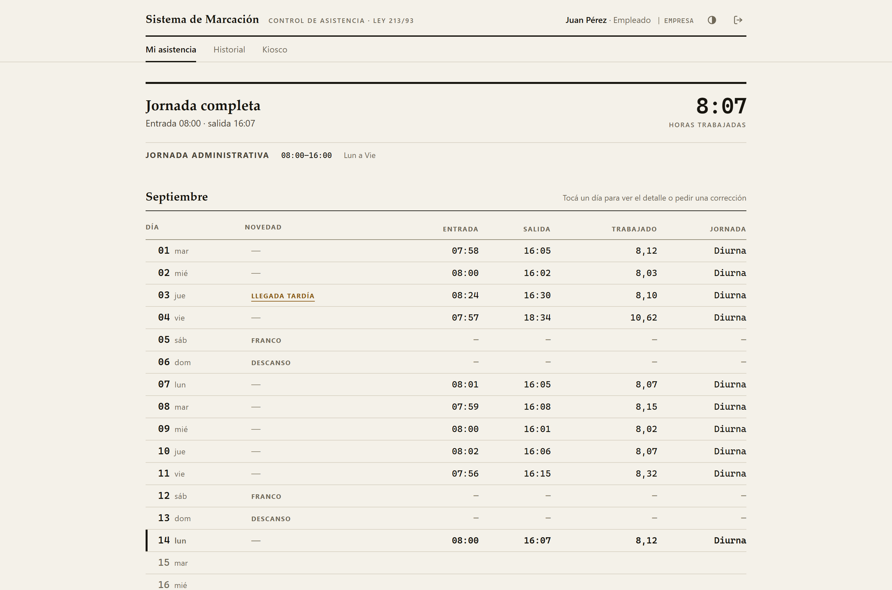
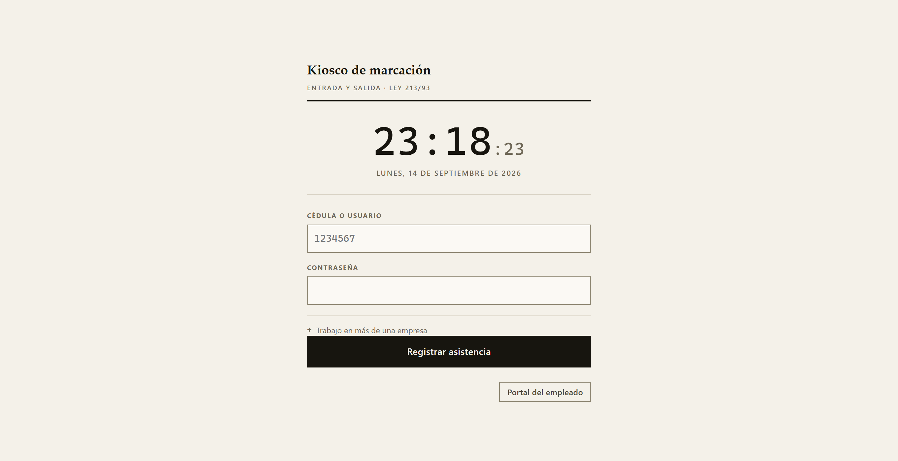
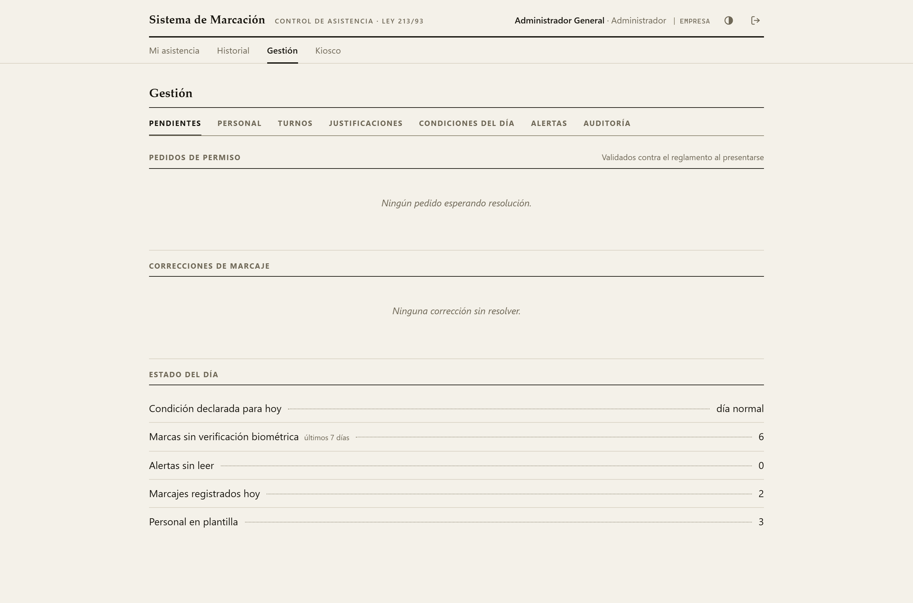
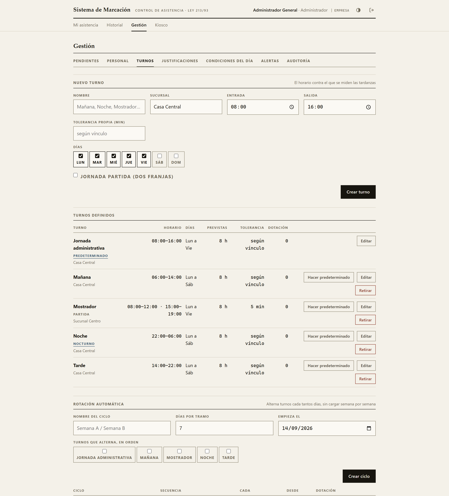

# Sistema de Marcación

[](https://github.com/nandres/sistema-marcacion-empresarial/actions/workflows/deploy.yml)

Control de asistencia laboral para Paraguay. Kiosco de escritorio, portal web
con panel de Recursos Humanos, lectura biométrica por hardware, y un motor que
liquida la jornada según el Código del Trabajo —diurna, nocturna, mixta,
feriados y horas extraordinarias— en lugar de dejarla para la planilla de
Excel del cierre de mes.

Una misma instalación aloja a **varias empresas** sin que ninguna vea los
datos de otra, y el aislamiento no depende de que nadie se olvide un `WHERE`:
lo impone PostgreSQL.



*Registro del mes de un empleado. Cada día lleva entrada, salida, horas
trabajadas y naturaleza de la jornada; los días que su turno no cubre figuran
como **franco**, no como ausencia, que es una diferencia que se paga. Los
datos de las capturas son inventados.*

> **Todavía no lo usa ningún cliente.** Funciona de punta a punta y la suite
> completa corre en integración continua sobre una base creada desde cero,
> pero nadie fichó en él para cobrar un sueldo. Ver [Estado](#estado).

## Qué hace

- **Marcación.** Entrada y salida desde el kiosco de escritorio o el del
  navegador, con verificación facial opcional y comprobante firmado.
- **Liquidación.** Jornada ordinaria por naturaleza (8 h diurna, 7 h nocturna,
  7 h 30 mixta), extras al +50 % y +100 %, recargo nocturno del 30 %, y
  feriados que se atribuyen por tramo y no por fecha de entrada.
- **Turnos.** Horario por empleado, jornada partida, turnos que cruzan la
  medianoche y rotación que se calcula sola.
- **Permisos y licencias.** Los 32 artículos del reglamento, pedidos desde el
  portal, validados contra el artículo invocado y con la cuota comprometida
  desde que se presenta el pedido.
- **Formularios.** La planilla de horas extraordinarias y la constancia de
  asistencia se componen solas desde los marcajes ya liquidados.
- **Correcciones.** El empleado reclama desde el día que toca en su registro;
  RRHH aprueba y la hora se repone por un circuito auditado.
- **Multiempresa.** Varios clientes en una instalación, resueltos por
  subdominio, cada uno con su cupo de empleados.
- **Sin conexión.** El kiosco sigue registrando y repone al volver, sin
  duplicar y sin perder la hora original.
- **Origen de cada marca.** Cada puesto se identifica con un token propio, así
  que una marcación registra desde dónde se hizo y *"marqué desde casa"* pasa
  a ser comprobable.
- **Respaldo verificable.** El volcado se compara contra su manifiesto al
  restaurar, y avisa si la clave biométrica no es la que cifró esas fotos.

### Cómo se ve

| Kiosco de marcación | Panel de Recursos Humanos |
|---|---|
|  |  |
| Cédula y contraseña. El sistema decide solo si es entrada o salida, por el estado del empleado y no por el calendario. | Abre por **excepción**: lo que está sin resolver. Cuando no hay nada pendiente no hay nada que mirar, y eso es el estado correcto. |

## Turnos

La hora contra la que se mide cada llegada sale del turno del empleado, no de
una constante del proceso.



*Cuadro de turnos. `Mostrador` es una jornada partida: cuatro marcas al día,
no dos con un descuento de almuerzo, porque descontar la pausa pierde el dato
de si la persona volvió a la hora. `Noche` cruza la medianoche. Abajo, la
rotación automática.*

Un **ciclo** describe la regla —qué turnos, en qué orden y cada cuántos días—
y el turno de cada día se calcula. No hay filas que regenerar y el calendario
sigue siendo correcto en cualquier fecha futura. La **posición** dentro del
ciclo es lo que mantiene a dos compañeros en turnos distintos rotando juntos:
sin ella el equipo entero rota en bloque y no queda nadie cubriendo el otro
turno.

Una rotación puntual se carga con vigencia y le gana al ciclo, así que al
vencer la persona vuelve sola a donde estaba. Nadie tiene que acordarse de
deshacer el cambio, que es donde estos sistemas acumulan gente en el turno
equivocado.

Editar un turno **no reescribe el pasado.** Lo que el turno es —su nombre,
su sucursal— se corrige en el lugar; lo que dice —qué días cubre, a qué hora,
con cuánta tolerancia— abre una versión con fecha de vigencia, y las
anteriores siguen rigiendo la suya. Corregir hoy una marca de marzo la
mide contra el horario de marzo.

```bash
GET /api/panel/turnos/{id}/historial
```

> **No alcanzaba con que los marcajes guardaran sus números.** Lo que se
> vuelve a calcular era lo que cambiaba: una corrección aprobada, el informe
> del mes pasado, las horas que reconoce una justificación vieja. Los tres
> pasaban a medirse contra el horario de hoy en cuanto RRHH tocaba un turno,
> sin que nadie hubiera tocado esos datos.

Guardar el mismo horario no abre una versión, y dos cambios el mismo día son
uno solo: una versión que duró cero días no es historia, es ruido. Un
horario cargado mal se corrige pasando `vigente_desde` hacia atrás — eso
reescribe la liquidación de ese período, así que se pide explícito y queda
anotado en la auditoría.

> **Dónde empieza una jornada lo decide el descanso, no el calendario.** El
> turno nocturno reparte una jornada entre dos días, así que la fecha no
> sirve; y una ventana fija hacia atrás tampoco, porque la entrada de anoche a
> las 22:00 seguiría contando al fichar hoy a la misma hora. Se camina hacia
> atrás y se corta en el primer hueco que constituya descanso entre jornadas.

## Aislamiento entre empresas

Cuatro capas, cada una tapando lo que la anterior deja pasar:

| Capa | Qué hace |
|---|---|
| Esquema | Catorce tablas de datos llevan `empresa_id` |
| Tiempo de ejecución | Una conexión sin empresa activa **falla**, no devuelve todo |
| Verificador estático | Una consulta nueva sin acotar rompe la build |
| PostgreSQL | Políticas por fila: al `WHERE` olvidado no le devuelve las filas de todos, le devuelve ninguna |

Ninguna sesión ve dos clientes a la vez. El cliente se resuelve por subdominio
(`acme.midominio.com.py`) y cada empresa tiene su cupo de empleados activos,
que se comprueba al dar de alta.

La garantía se verifica **atacándola**: la prueba crea un rol restringido, se
conecta con él y lanza consultas deliberadamente sin acotar, más un `INSERT`
contra la empresa ajena. Comprobar que la política figura en `pg_policies` no
dice nada; esto sí.

> **Las políticas por fila no alcanzan a un superusuario.** PostgreSQL lo
> exceptúa siempre. Si el servicio corre con el rol administrador, el
> aislamiento queda sostenido solo por la aplicación. Ver
> [Rol del servicio](#rol-del-servicio).

## Stack

| Capa | Tecnología |
|---|---|
| Escritorio | CustomTkinter + matplotlib |
| Web | FastAPI + WebSockets, interfaz en archivos propios |
| Base de datos | PostgreSQL 14+ |
| Cola sin conexión | SQLite, firmada con HMAC-SHA256 |
| Biometría | OpenCV (LBPH) · AES-256-GCM en reposo |
| Hardware | Relojes ZKTeco por TCP/IP, puerto 4370 |
| Contenedor | python:3.11-slim + gunicorn |

## Requisitos

- Python 3.11 o superior
- PostgreSQL 14 o superior
- Cámara web, solo si se usa el reconocimiento facial

## Instalación

```bash
git clone https://github.com/nandres/sistema-marcacion-empresarial.git
cd sistema-marcacion-empresarial
python -m venv .venv
source .venv/bin/activate   # En Windows: .venv\Scripts\activate
pip install -r requirements.txt
```

### Configuración

```bash
cp .env.ejemplo .env
```

La plantilla lista todas las variables con sus por qué. Lo mínimo:

```ini
DB_HOST=localhost
DB_PORT=5432
DB_NAME=marcacion
DB_USER=tu_usuario
DB_PASSWORD=tu_contraseña

JWT_SECRET_KEY=
COMPROBANTE_CLAVE=
BIOMETRIA_CLAVE=

JORNADA_INICIO=08:00        # Turno con el que se siembra la instalación
EMPRESA_NOMBRE=Empresa      # Razón social de la primera migración
EMPRESA_ACTIVA=             # Vacío con un solo cliente
DOMINIO_BASE=               # Para resolver el cliente por subdominio
BIOMETRIA_OBLIGATORIA=0     # Bloquear lo que el motor no pueda verificar
BIOMETRIA_PRUEBA_VIDA=0     # Exigir un gesto antes de aceptar la marca
```

Las tres claves son obligatorias, no tienen valor por defecto y exigen 32
caracteres o más. Si falta alguna el proceso aborta al arrancar, en lugar de
firmar —o cifrar— con una clave que cualquiera puede leer en el repositorio.

```bash
python -c "import secrets; print(secrets.token_urlsafe(48))"
python -c "import sys; sys.path.insert(0,'src'); import biometria; print(biometria.generar_clave())"
```

`COMPROBANTE_CLAVE` firma además las marcas de la cola sin conexión: cambiarla
invalida lo que haya quedado encolado sin reponer.

> **`BIOMETRIA_CLAVE` vive fuera de la base a propósito**, para que un backup
> robado no traiga con qué abrirlo. La contracara es que restaurar la base sin
> la clave **no recupera las fotos**. Guardarla junto al backup anula la
> protección; no guardarla en ningún lado pierde el dato.

### Rol del servicio

El proceso que atiende tráfico tiene que correr con un rol restringido, o las
políticas de aislamiento quedan inertes. Se crea una sola vez:

```bash
python src/migrate.py rol-app
```

Imprime el `DB_USER` y el `DB_PASSWORD` que van en el `.env` **del servicio**.
El rol administrador se sigue usando solo para migrar, porque el restringido
no puede —ni debe— alterar tablas. El comando es idempotente: sobre un rol que
ya existe refresca los permisos sin rotar la contraseña, para no cortarle el
acceso a un servicio en marcha.

`python src/migrate.py` informa en cada corrida si el aislamiento está en vigor
o inerte.

### Arranque

```bash
python src/migrate.py      # aplica el esquema; crea la base si no existe
python src/web_server.py   # http://127.0.0.1:8000
python src/gui.py          # kiosco y panel de escritorio
python src/app.py          # CLI administrativa
```

Usuarios de demostración: `admin` / `admin123` y `juan` / `clave123`.

> **Las migraciones son un paso aparte, previo a levantar nada.** El DDL toma
> locks exclusivos de tabla, así que cuatro workers aplicándolo a la vez se
> bloquean entre sí. El contenedor lo respeta: migra una vez y recién después
> arranca gunicorn.

## Instalador del kiosco

El kiosco de escritorio se entrega empaquetado: el cliente no instala Python
ni clona nada.

```bash
pip install -r requirements-dev.txt
pyinstaller empaquetado/kiosco.spec --noconfirm
```

Queda una carpeta en `dist/Sistema de Marcacion/`. Se copia a la PC del
mostrador y se crea un `.env` **junto al ejecutable** con los datos de
conexión. El programa lo busca ahí primero, antes que en cualquier otro lado.

Es una carpeta y no un archivo único a propósito. Un ejecutable único
descomprime OpenCV y matplotlib en un temporal en cada arranque —se nota en
una PC de mostrador— y, peor, deja la cola sin conexión en ese temporal: al
cerrar el programa se borraría junto con las marcas que todavía no se
repusieron, que es exactamente lo que la cola existe para evitar.

Etiquetar una versión (`git tag v1.2.0 && git push --tags`) construye el
ejecutable en Windows, comprueba que el modelo de detección facial haya
viajado adentro, y publica un release en borrador con el zip y su `sha256`.

> **Si el kiosco no abre al hacer doble clic**, dejó el motivo en
> `error-al-arrancar.txt`, junto al ejecutable. Una aplicación de ventana sin
> consola que falla al arrancar no muestra nada, y "no pasa nada" no se puede
> diagnosticar por teléfono.

## Respaldo

```bash
python src/respaldo.py crear
python src/respaldo.py verificar respaldos/marcacion-AAAAMMDD-HHMMSS.dump
python src/respaldo.py restaurar respaldos/marcacion-AAAAMMDD-HHMMSS.dump
```

Cada respaldo guarda al lado un manifiesto con la fecha, los recuentos de las
tablas que importan y la **huella** de `BIOMETRIA_CLAVE` —su SHA-256 truncado,
no la clave—. Al restaurar se compara: si la clave no es la del respaldo, se
detiene antes de tocar nada en lugar de dejar fotos que nadie va a poder
descifrar. Después contrasta lo que quedó contra el manifiesto, porque
`pg_restore` devuelve código distinto de cero por avisos que no son fallas.

> **Un respaldo de la base no alcanza para volver a arrancar.** Falta
> `BIOMETRIA_CLAVE`, que vive fuera de la base justamente para que un volcado
> robado no sirva. Guardala en otro lugar que el respaldo: juntos entregan los
> rostros de toda la plantilla; separados, ninguno sirve solo.

## Operación

Tres cosas que no cambian nada de lo que ve un empleado y deciden si esto se
puede sostener una vez instalado.

**El registro sale por la salida estándar**, que es donde lo busca cualquier
orquestador. Una línea por petición, con un identificador que además viaja
de vuelta en la cabecera `X-Peticion`: quien reporta *"me dio error a las
7:42"* trae ese código y el registro se busca por ahí.

```
2026-09-15 07:42:11 INFO    web          [3f9c1a44] POST /api/marcar -> 200 en 41 ms
2026-09-15 07:42:13 WARNING web          [7b02e5d1] credenciales rechazadas para '4512883' desde 10.0.0.23
2026-09-15 07:42:19 WARNING database     [c1d4f8a0] el pool de 10 conexiones se agotó; la petición esperó 380 ms
```

Nunca entran ahí contraseñas, tokens de sesión, tokens de kiosco ni
plantillas faciales: un registro operativo se le pasa a un tercero el día que
pedir ayuda, y ese día tiene que poder copiarse entero. `LOG_NIVEL` ajusta el
detalle; en `DEBUG` también hablan las bibliotecas, que el resto del tiempo
están calladas para que el registro lo escriba el sistema y no `httpx`.

**La salud se mide contra la base**, en `GET /salud`, sin credenciales:

```bash
curl -fsS http://127.0.0.1:8000/salud
# {"estado":"ok"}  ·  503 si la base no contesta
```

El chequeo anterior pedía la portada, que arma el portal entero sin tocar
PostgreSQL: con la base caída el contenedor se reportaba sano y nadie lo
reiniciaba. La respuesta no dice versiones ni nombres de host, porque la
consulta cualquiera.

**La base declara su versión de esquema**, y el servidor se niega a arrancar
si el código es más nuevo que ella:

```bash
python src/migrate.py estado
```

```
Esquema de la base: versión 1
Esperado por este código: versión 1

Aplicado:
  2026-09-15 13:26  base:1

Al día: esta base puede atender tráfico con este código.
```

> **Antes se contaban tablas contra una lista escrita a mano, y la lista
> envejeció.** Cuando el esquema sumó `dispositivos`, una base migrada antes
> seguía dando el recuento por bueno: el servidor arrancaba sin la tabla que
> `/api/marcar` necesita y el fallo aparecía en la primera marcación, no al
> arrancar, que es cuando todavía se puede corregir.

El DDL base es idempotente y se repite sin consecuencias, así que agregar una
tabla o una columna no necesita nada más que subir `ESQUEMA_VERSION`. Lo que
**no** se puede repetir —rellenar una columna nueva desde las viejas, corregir
filas cargadas mal, cambiar un tipo— va en `PASOS_UNICOS`, y cada paso queda
anotado en la base con su nombre para que la migración siguiente lo saltee.

## Comandos

```bash
python tests/setup_ci.py           # siembra admin y juan en una base limpia
python tests/test_motor_horario.py # turnos frontera: jornadas, recargos, feriados
python tests/test_turnos.py        # jornada partida, francos, rotación
python tests/test_multiempresa.py  # dos clientes alojados, ningún dato cruzado
python tests/guardia_arrendamiento.py  # ninguna consulta de cliente sin acotar
python tests/test_operacion.py     # registro, salud y versión del esquema
python tests/test_turnos_historicos.py # el pasado se mide con el horario del pasado
python src/migrate.py estado       # en qué versión está esta base
python src/app.py verificar-comprobante ticket.txt  # ¿este papel lo emitimos?
```

Son treinta conjuntos en total; el pipeline los corre todos. La lista
completa está en `.github/workflows/deploy.yml`, que es el único lugar donde
conviene mantenerla.

`guardia_arrendamiento.py` no ejecuta nada: lee el árbol sintáctico y falla si
encuentra una consulta a una tabla de cliente sin `empresa_id`. Una regla que
depende de que setenta consultas se acuerden de filtrar es una fuga esperando
la consulta setenta y cuatro.

## Arquitectura

```
src/
├── web_server.py   API del kiosco, el portal y el panel (FastAPI + WebSockets)
├── gui.py          ventana del kiosco y tablero del empleado (CustomTkinter)
├── gestion.py      panel de Recursos Humanos, una pestaña por trámite
├── interfaz.py     vocabulario visual: paleta, tipografía y piezas
├── app.py          CLI administrativa
├── clock_engine.py motor horario y desglose legal
├── turnos.py       tramos, días, rotación y ciclos
├── reglamento.py   catálogo de permisos, cuotas y días hábiles
├── esquema.py      DDL, migraciones y aislamiento por fila
├── database.py     consultas, acotadas por empresa, con auditoría JSONB
├── registro.py     registro operativo con identificador por petición
├── auth.py         autenticación, roles y JWT
├── biometria.py    cifrado en reposo de las plantillas faciales
├── facial.py       veredictos del reconocimiento y prueba de vida
├── offline_queue.py  cola local firmada
└── sync_worker.py  reposición idempotente
```

El corte entre `esquema.py` y `database.py` no es de tamaño: el DDL toma locks
exclusivos de tabla, corre una vez en el despliegue y con el rol
administrador, mientras que las consultas corren miles de veces por hora con
un rol que no puede alterar nada. Lo mismo entre `interfaz.py` y el resto del
escritorio: el vocabulario visual no sabe qué es un marcaje.

Tres reglas que conviene saber antes de tocar código:

1. **Una consulta a una tabla de cliente lleva `empresa_id`, siempre.** No es
   disciplina: el verificador estático de `tests/` rompe la build, y en
   ejecución una conexión sin empresa activa falla en vez de devolver todo.
2. **El desglose de una jornada se persiste en un solo lugar**
   (`persistir_desglose`). El cierre en línea, la reposición sin conexión y la
   corrección aprobada por RRHH convergen ahí para que las tres rutas no
   puedan divergir en cómo guardan el mismo cálculo.
3. **Agregar una tabla de datos obliga a decidir si entra en
   `TABLAS_DE_EMPRESA`.** Si entra, hereda la política de aislamiento; si no
   entra, la prueba de multiempresa falla y hay que justificar por qué.

## Normativa

| Norma | Qué resuelve |
|---|---|
| Ley 213/1993 | Jornada ordinaria y extraordinaria, recargo nocturno del 30 %, domingos al 100 % |
| Ley 6380/2019 | Aguinaldo proporcional y acumulado sobre la antigüedad real del contrato |
| Ley 6534/2020 | La plantilla facial es dato de categoría especial: cifrada, y destruida con la baja |
| Res. 3028/2024 | Tolerancia climática y reglas distintas para pasantes y funcionarios |
| Res. 1307/2010 | Catálogo de permisos y licencias, con cuotas por horas o por usos |

La condición excepcional del día —lluvia intensa, corte de rutas, paro de
transporte— la **declara Recursos Humanos** para toda la plantilla, con firma
y auditoría. No es una casilla que marque quien llega tarde.

## Biometría

El reconocimiento tiene **tres veredictos**, no dos. Un rostro que no coincide
bloquea siempre y dispara una alerta de fraude. Lo que el motor no puede
comprobar —sin foto de referencia, sin cámara— nunca se da por verificado:
según `BIOMETRIA_OBLIGATORIA` se bloquea, o se registra como *No verificada*
con aviso a RRHH.

Con `BIOMETRIA_PRUEBA_VIDA` encendida, el kiosco sortea un gesto —acercarse,
girar— y lo exige antes de capturar. El gesto se sortea en cada marcación a
propósito: uno fijo se graba una vez en video y se reproduce siempre.

> **Es un disuasivo, no una prueba.** Deja afuera el ataque habitual —una foto
> sostenida frente a la cámara— pero quien mueva el teléfono siguiendo la
> consigna pasa igual. Cerrarlo de verdad pide una cámara con infrarrojo o
> profundidad, o un modelo de anti-suplantación entrenado.

## Licencia

Propietario, todos los derechos reservados — ver [LICENSE](LICENSE). El código
está publicado para consulta y evaluación; usarlo en producción o derivar de
él requiere autorización escrita.

## Idioma

Las entidades del dominio, los nombres de tabla y los textos de interfaz van
en **español** (`marcajes`, `turnos`, `justificaciones`, `jornada`, `franco`).
Los comentarios de código y los mensajes de commit también.

Eso alcanza a los nombres que **operan** sobre el dominio: `crear_usuario`,
`marcar_entrada`, `listar_turnos`. Quedan en inglés los que nombran un
mecanismo y no vocabulario del cliente — `web_server`, `rate_limit`,
`sync_worker`, `offline_queue` —, porque describen la máquina y no el negocio.

> **La regla estaba escrita a medias y el código lo mostraba.** Convivían
> `db.listar_turnos()` y `db.list_users()` en la misma clase: lo que estaba
> dicho era que el dominio va en español, no que eso incluye a los métodos
> que lo manipulan.

## Estado

Las suites pasan en integración continua, sobre un PostgreSQL transitorio, un
esquema creado desde cero y una pantalla virtual para las dos interfaces de
escritorio. El pipeline construye la imagen y la publica en el registro de
contenedores, y etiquetar una versión arma el instalador del kiosco.

El pico de marcación está medido: **150 personas marcando en el mismo instante
entran todas, en menos de cinco segundos**, sin perder ni duplicar ninguna, en
un solo proceso. El techo de unas 32 por segundo es `bcrypt` verificando
contraseñas, caro por diseño, así que escala con procesos y CPU.

Lo que falta, dicho de frente:

- **Multi-sede sin husos propios.** La sucursal es hoy un campo del turno:
  alcanza para horarios por sede, no para sedes en husos distintos.
- **Facturación**, fuera de alcance a propósito: el cupo por empresa existe
  para hacer cumplible un plan, no para cobrarlo.

La documentación técnica vive en [`docs/notas/`](docs/notas/) —un vault de
Obsidian—: la bitácora resume las fases construidas con sus commits, y la
auditoría lista cada defecto encontrado, cómo se cerró y qué sigue abierto.
