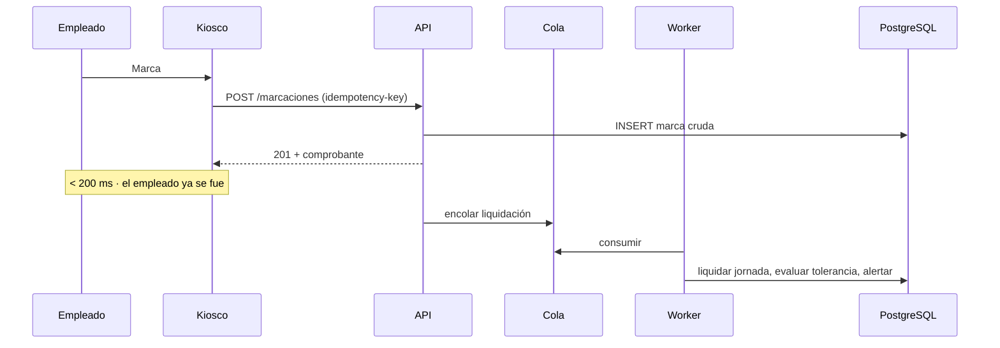

# Antifraude y Resiliencia en Picos de Marcación

> Los dos problemas que definen si un sistema de asistencia sirve: que nadie pueda marcar por otro, y que el sistema aguante el minuto en que todos marcan a la vez. Complementa [[Auditoría Técnica · Hallazgos Críticos]] con el análisis específico de ambos frentes.

## Parte I · Fraude

### Dónde se rompe hoy

Un sistema de asistencia tiene cinco superficies de fraude. El estado actual de cada una:

| Vector | Qué permite | Estado |
| --- | --- | --- |
| **Buddy punching** | Marcar por un compañero ausente | Abierto — el kiosco web solo pide cédula y contraseña |
| **Auto-declaración de condiciones** | Concederse la tolerancia climática | Abierto — checkbox del propio empleado |
| **Inyección en la cola offline** | Fabricar marcas históricas | Abierto — la cola no verifica credenciales |
| **Abuso de la corrección retroactiva** | Reescribir horas ya liquidadas | Parcial — queda auditado, pero sin límites |
| **Fraude del administrador** | Editar marcas propias o de terceros | Parcial — auditado, pero el auditor es el mismo actor |

### Buddy punching: el kiosco web no verifica a nadie

El README presenta la validación facial como control central. En la práctica, **`/api/marcar` no la invoca**: `api_marcar` (`web_server.py:1205`) autentica con `auth.authenticate` y llama directo a `registrar_asistencia`. La biometría existe solo en el kiosco de escritorio.

Es decir: quien conozca la cédula y contraseña de un compañero marca por él desde cualquier navegador, desde su casa, sin cámara de por medio. Y si además el compañero no tiene foto registrada, el kiosco de escritorio tampoco lo detendría (P1-2).

Tres capas, en orden de costo/beneficio:

**Vincular la marca a un dispositivo.** Una marcación sin origen es una marcación sin evidencia. Cada kiosco debería tener identidad propia (certificado o token de dispositivo) y toda marca registrar desde dónde se hizo. Es barato, no afecta la experiencia y convierte "marqué desde casa" en un hecho detectable.

**Geocerca en la marcación móvil.** Si se habilita marcación desde el teléfono, la coordenada tiene que validarse contra el polígono de la sucursal en el servidor — nunca en el cliente. Con dos consideraciones que suelen olvidarse: la geolocalización es dato personal bajo la Ley 6534/2020, así que se guarda la **decisión** (dentro/fuera del perímetro) y no el rastro de coordenadas; y el GPS falla en interiores, por lo que el rechazo debe degradar a "requiere verificación", no a "denegado".

**Biometría con prueba de vida.** LBPH sobre Haar Cascade es tecnología de 2006: una foto en la pantalla de un celular la supera. Si la biometría es el control que sostiene la disciplina laboral, necesita *embeddings* faciales modernos y detección de vida pasiva. Si no se va a invertir en eso, es más honesto no presentarla como control antifraude.

### El principio que se está violando

**Quien está sujeto a una regla no puede controlar el dato que activa la regla.**

El checkbox de "día lluvioso" lo viola de forma directa (P1-1). Pero el mismo principio ordena el resto del diseño: la condición climática es un estado del día que declara RRHH o consume un servicio meteorológico por sucursal; el turno lo asigna el supervisor; la hora la pone el servidor, nunca el cliente.

Ese último punto importa: `MotorDeJornada.marcar_entrada` usa `ahora_local()` del servidor, que es correcto. Pero `sync_worker` reinyecta el `momento_iso` que escribió el kiosco, y el reloj del kiosco es manipulable. Una marca offline necesita, como mínimo, ventana máxima de antigüedad y comparación contra la hora de recepción.

### Evidencia mínima por marca

Hoy `marcajes` guarda hora, tardanza, feriado, incidencia y condición climática. Para sostener una sanción disciplinaria ante un reclamo laboral falta:

- **Origen**: qué dispositivo, qué IP, qué canal (kiosco / web / biométrico / sincronización offline).
- **Verificación**: qué controles pasó y con qué resultado — no solo si pasó, sino si se **omitió** (el caso "sin foto registrada" debe quedar escrito).
- **Procedencia**: si la marca es original, sincronizada o corregida, y en el último caso quién la corrigió y sobre qué valor previo.

Lo tercero existe en `logs_auditoria` pero vive separado de la marca. Al reconstruir un mes, nadie cruza ambas tablas: la marca corregida debe poder explicarse a sí misma.

### La corrección retroactiva necesita límites

`aprobar_solicitud_correccion` audita correctamente, pero no impone restricciones. Faltan tres:

1. **Ventana temporal.** El propio reglamento la fija: el Art. 13 admite la omisión de registro solo "dentro del siguiente día hábil". El código no la aplica.
2. **Período cerrado.** Una vez liquidado y pagado el mes, una corrección no puede modificar el histórico en silencio; genera un ajuste en el período abierto.
3. **Segregación de funciones.** Quien aprueba una corrección no debería poder aprobar la suya propia. Hoy un usuario con rol RRHH puede resolver su propio reclamo, y la auditoría lo registra sin objetar.

---

## Parte II · Carga

### La forma real del pico

El tráfico de un sistema de asistencia no es constante: es un pulso. Con 200 empleados y entrada a las 08:00, alrededor del 60 % marca en una ventana de tres minutos. Son ~2 marcaciones por segundo en pico — un volumen que cualquier servidor debería absorber sin despeinarse.

El problema no es el volumen. Es lo que cada petición hace.

**Cada marcación dispara dos veces el esquema completo.** `_cliente()` ejecuta `initialize()` —unas 40 sentencias DDL— y cada endpoint autenticado lo llama dos veces (dependencia + handler). En la ventana de tres minutos eso son del orden de **~10.000 sentencias DDL**, varias de ellas tomando `ACCESS EXCLUSIVE LOCK` sobre `justificaciones`. Con cuatro workers compitiendo por ese lock, las peticiones dejan de ser paralelas: se forman en fila.

El pico no se cae por carga. Se cae por autobloqueo.

**El reconocimiento facial reentrena por cada marca.** `facial.validar` reconstruye el modelo LBPH desde cero con todas las fotos de la empresa, generando seis variantes por rostro. Con 200 empleados son 1.200 imágenes de 200×200 entrenadas **en cada marcación**, justo en el minuto en que llegan todas juntas.

**Una conexión compartida sin pool.** `Database` mantiene `self.connection` única y `psycopg2` no admite uso concurrente de la misma conexión desde varios hilos. En la GUI de escritorio, el hilo de sincronización comparte conexión con el hilo de interfaz.

### Camino de escritura propuesto

La marcación tiene una propiedad que conviene explotar: **el empleado necesita la confirmación, no la liquidación**. Nadie espera frente al kiosco a que se calculen sus horas extra.

La ruta síncrona se reduce a autenticar, validar y escribir una fila. Todo lo caro —desglose legal, conteo de tardanzas del mes, alertas, notificaciones— pasa a un worker que puede demorarse segundos sin que nadie lo note.

La clave de idempotencia no es un adorno: el kiosco reintenta ante timeout, y sin ella un reintento genera una marca duplicada. El mecanismo ya existe (`sync_id` con índice parcial único) y solo hay que extenderlo a la ruta en línea.

### Preparación concreta

| Cambio | Efecto |
| --- | --- |
| Migraciones fuera del request | Elimina ~10.000 sentencias DDL del pico |
| Pool de conexiones (`psycopg_pool` / PgBouncer) | Reutiliza conexiones en lugar de abrir una por petición |
| Liquidación asíncrona | Deja la ruta síncrona en un solo `INSERT` |
| Modelo facial precargado y compartido | Saca el entrenamiento del camino crítico |
| Redis Pub/Sub para alertas | Arregla P3-4 y sobrevive al escalado horizontal |
| Caché de disponibilidad de permisos | Evita el escaneo completo de `justificaciones` (P3-9) |

### Degradación ante fallos

La cola offline ya resuelve el caso "PostgreSQL no responde" en el kiosco de escritorio, y es la mejor decisión de diseño del sistema: la marcación nunca se pierde. Falta extender ese criterio al resto.

Si la base no responde, el kiosco web hoy devuelve un error y el empleado se queda sin marcar. Si el reconocimiento facial se cae, el resultado correcto es **registrar sin verificar y marcarlo como pendiente de revisión** — nunca bloquear la entrada de alguien que llegó a trabajar ni, en el extremo opuesto, dejarlo pasar sin dejar constancia.

La regla general: **el registro de asistencia nunca se bloquea; lo que se bloquea es la validación silenciosa.** Un empleado que no puede marcar genera un conflicto laboral inmediato; una marca sin verificar genera una tarea de RRHH. La segunda es infinitamente más barata.

## Enlaces

[[Auditoría Técnica · Hallazgos Críticos]] · [[Arquitectura Objetivo · Plataforma y Portal del Empleado]] · [[Seguridad y Cifrado de Comunicaciones]] · [[Estructura Web y Conexión Biométrica]] · [[Despliegue en la Nube e Infraestructura SaaS]]
