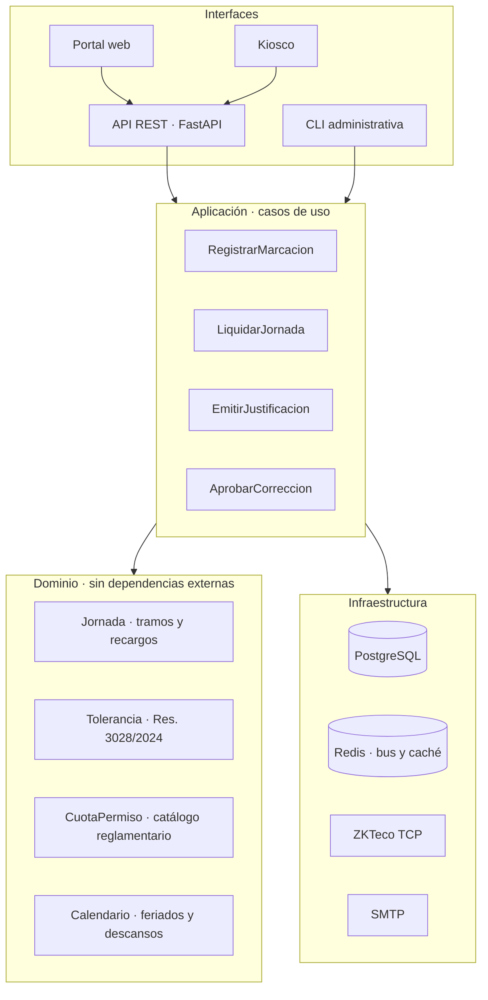

# Arquitectura Objetivo · Plataforma y Portal del Empleado

> Plan de evolución del sistema actual hacia una plataforma multi-empresa con portal de auto-consulta. Parte de los defectos estructurales identificados en [[Auditoría Técnica · Hallazgos Críticos]] y propone el destino, no un rediseño desde cero: el motor legal y el catálogo reglamentario son los activos que se conservan.

> [!success] Lo ejecutado el 2026-09-14
> El **rediseño del portal** descrito más abajo está implementado, y con él la extracción del HTML y la convergencia del motor horario. Lo que sigue pendiente es el modelo de datos faltante (turnos, `fecha_ingreso`, organizaciones) y el pool de conexiones. Detalle visual en [[Sistema de Diseño · Planilla]].

## Diagnóstico estructural

El sistema funciona, pero tres decisiones tempranas limitan todo lo que venga después.

**El dominio no existe como capa.** Las reglas laborales viven mezcladas con acceso a datos: `clock_engine.calcular_horas_paraguay` es una función pura y comprobable, pero `evaluar_asistencia` recibe un `Database` y consulta la base para decidir una regla de negocio. Eso hace que la regla no se pueda probar sin PostgreSQL, y que el mismo cálculo se reimplemente en tres lugares (`ClockEngine.clock_out`, `sync_worker._sincronizar_salida`, `auth._corregir_salida`) con resultados que ya divergen entre sí.

**La presentación está incrustada en el servidor.** `web_server.py` son 1.490 líneas, de las cuales ~800 son un `f-string` de HTML con llaves duplicadas (`{{`) para escapar el formateo. Cada cambio de interfaz toca el archivo que también define los endpoints y las reglas de autorización. `gui.py` suma otras 2.575 líneas con la misma mezcla. No hay forma de que un diseñador toque la interfaz sin riesgo de romper la API.

**Falta el modelo de horarios.** No hay tabla de turnos: la hora de entrada es `INICIO_JORNADA`, una constante global del proceso leída de una variable de entorno. El sistema no puede representar turnos rotativos, jornadas partidas, horarios por sucursal ni cambios de turno — que es la razón principal por la que una empresa compra un software de asistencia en lugar de una planilla.

## Modelo de datos faltante

Las entidades que hoy no existen y bloquean los casos de uso reales:

| Entidad | Por qué falta hoy | Qué desbloquea |
| --- | --- | --- |
| `turnos` | La jornada es una constante de proceso | Horarios rotativos, jornada partida, nocturnidad real |
| `asignaciones_turno` | — | Qué turno le toca a quién y desde cuándo |
| `feriados` | `frozenset` hardcodeado de 2026 | Que el sistema siga siendo correcto en 2027 |
| `organizaciones` / `sucursales` | Instancia única | Multi-empresa, multi-sede, husos por sede |
| `dispositivos` | El kiosco no se identifica | Trazabilidad de dónde se marcó, geocerca |
| `users.fecha_ingreso` | Se usa `created_at` | Antigüedad y aguinaldo correctos tras migrar la plantilla |
| `users.activo` / `fecha_baja` | Solo existe `DELETE` | Histórico de bajas sin borrar marcajes |

El campo `activo` merece mención aparte: `_personal_publico` (`web_server.py:1187`) ya lo lista como campo público, pero **la columna no existe en el esquema**. El filtro por comprensión lo descarta en silencio. Es documentación que se adelantó a la implementación.

## Separación en capas

La reorganización propuesta no cambia el lenguaje ni el framework; mueve responsabilidades.

La regla que ordena todo: **el dominio no importa nada del proyecto**. `Jornada.liquidar(entrada, salida, calendario, turno)` recibe datos y devuelve un desglose; no sabe que existe PostgreSQL. Eso permite cubrir la Ley 213 con pruebas de tabla —decenas de turnos frontera— sin levantar una base, que es justo lo que hoy no se puede hacer.

`reglamento.py` ya cumple esa condición ("El módulo es autocontenido") y es el modelo a seguir para el resto.

### Migración por partes

El orden importa porque cada paso deja el sistema funcionando:

1. ✅ **Extraer el HTML** de `web_server.py` a archivos servidos como estáticos. Hecho el 2026-09-14: el archivo pasó de 1.565 a **774 líneas** y la interfaz vive en `src/static`. Además permitió endurecer la CSP a `script-src 'self'`. Ver [[Sistema de Diseño · Planilla]].
2. ✅ **Convergencia del dominio horario**: los tres llamadores que liquidaban por su cuenta (cierre en línea, sincronización offline y corrección de RRHH) ahora pasan por `calcular_horas_paraguay` y escriben por `persistir_desglose`. Falta el paso final de moverlo a un módulo sin dependencia de `Database`.
3. **Introducir el repositorio**: los casos de uso dependen de una interfaz (`RepositorioMarcajes`), no de `Database`. Habilita pruebas en memoria.
4. ✅ **Migraciones fuera del request** (`migrate.py`). Falta el pool de conexiones.
5. **Turnos en base**, que es lo que convierte al producto en vendible fuera de una sola empresa. Los feriados ya salieron del código.

## Portal del empleado

Hoy el portal responde bien a "¿cuántas horas extra tengo?" pero mal a las preguntas que el empleado se hace de verdad.

### Qué pregunta realmente un empleado

Las tres preguntas que generan el 90 % de las consultas a RRHH:

1. **"¿Marqué hoy?"** — ansiedad inmediata, resuelta en el primer segundo de la pantalla.
2. **"¿Me van a descontar?"** — el empleado no piensa en "horas ordinarias", piensa en si el retraso del martes le cuesta dinero.
3. **"¿Cuántos días me quedan?"** — vacaciones y permisos, con la cuenta hecha, no con la tabla del reglamento.

El tablero actual abre con cuatro tarjetas de igual peso (vacaciones, permisos, extra 50 %, extra 100 %). Ninguna responde la primera pregunta. La jerarquía visual trata al aguinaldo proyectado y al estado de la marcación de hoy como información del mismo rango.

### Reordenamiento propuesto

**Franja de estado, arriba de todo.** Una sola línea que diga en lenguaje llano dónde está parado el empleado hoy: *"Entrada registrada 07:58 · jornada en curso · 4 h 12 min"*, o *"Sin marcar · tu turno empezó hace 20 minutos"*. Es la única información con caducidad de minutos; todo lo demás puede esperar un scroll.

**El mes como registro, no como gráfico de barras.** El gráfico SVG original mostraba horas ordinarias por día, un dato que al empleado no le dice nada. Lo que necesita ver es la **secuencia de días con su estado**: normal, tardanza, justificado, feriado, sin marcar.

La primera versión de esta idea fue una tira de cuadraditos coloreados, que respondía "tuve tres tardanzas este mes" pero no "a qué hora salí el martes". Lo implementado hoy es una planilla de seis columnas —día, novedad, entrada, salida, trabajado, jornada— que responde las dos: la columna de novedades se escanea igual que la de la hoja de papel. Ver [[Sistema de Diseño · Planilla]].

**Las incidencias, con su consecuencia explícita.** Hoy una tardanza aparece como una etiqueta roja. Debería decir qué implica: *"Llegada tardía · 3.ª del mes · a la 4.ª se pierde la tolerancia (Art. 3028/2024)"*. El reglamento ya está codificado en `reglamento.py`; falta exponerlo en el momento en que el empleado puede actuar sobre él.

**Un solo camino para reclamar.** El formulario de corrección está siempre visible, desacoplado del día que se quiere corregir. Debería nacer desde la incidencia: el empleado ve el martes marcado como falta, toca el día y el reclamo llega con fecha y tipo precargados. Menos campos que llenar, menos reclamos mal cargados que RRHH tiene que devolver.

### Lo que no debe verse

El portal expone hoy el **aguinaldo proyectado** en el tablero. Es un número que depende de `created_at` (ver P3-6) y de una proyección a fin de año que sobreestima lo devengado. Mostrar dinero mal calculado es peor que no mostrarlo: genera reclamos que el sistema no puede sostener. Hasta que la fórmula tenga `fecha_ingreso` y el recargo nocturno, ese dato debería quedar en el panel de RRHH, no en el del empleado.

## Interfaz de RRHH

El panel de gestión resuelve el CRUD pero no el trabajo real, que es **por excepción**: de 200 empleados, a RRHH le importan los 12 que tuvieron una incidencia ayer.

La pantalla de entrada debería ser una bandeja de pendientes ordenada por urgencia —correcciones sin resolver, cuotas por agotarse, entradas abiertas sin cierre, marcas sin verificación biométrica— y no un resumen de contadores. Las tarjetas de "Empleados registrados" y "Justificaciones emitidas" son métricas de vanidad: nadie actúa sobre ellas.

La tabla de personal tampoco escala: `renderTablaPersonal` dibuja la plantilla completa sin paginar ni buscar. Con 200 filas ya es incómoda; con 1.000 es inusable.

## Del sistema al producto SaaS

Tres condiciones separan el estado actual de una plataforma multi-empresa:

**Aislamiento por organización.** Toda tabla necesita `organizacion_id` y toda consulta necesita filtrarlo. La forma robusta en PostgreSQL es *Row Level Security* con el identificador en el contexto de sesión, para que un `WHERE` olvidado no filtre datos entre clientes.

**Configuración como dato.** Tolerancias, jornadas, feriados y catálogo de permisos hoy son constantes de módulo. Una empresa con tolerancia de 5 minutos y jornada de 06:00 exige recompilar. Debe ser configuración por organización, versionada —porque una liquidación de hace seis meses tiene que recalcularse con las reglas vigentes entonces, no con las de hoy.

**Marcación asíncrona.** El pico de las 08:00 es el problema de carga central; su tratamiento está en [[Antifraude y Resiliencia en Picos de Marcación]].

## Enlaces

[[Auditoría Técnica · Hallazgos Críticos]] · [[Antifraude y Resiliencia en Picos de Marcación]] · [[Ecosistema Sistema de Marcación]] · [[Diseño de Interfaz Premium UI-UX]] · [[Despliegue en la Nube e Infraestructura SaaS]]
