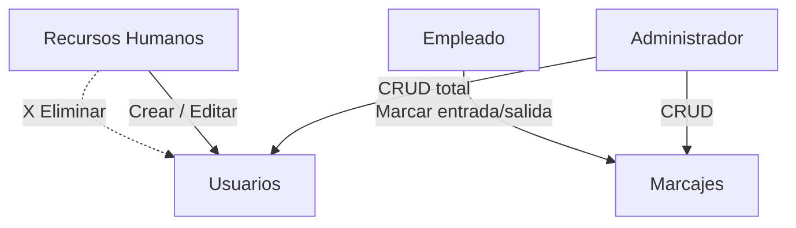

# Control de Roles y Permisos RBAC

> Diseño del control de accesos basado en roles (RBAC) del [[Ecosistema Sistema de Marcación]]. Se une al tejido junto a [[Módulo de Gestión de Usuarios]].

## Modelo de roles

La tabla `roles` define tres roles semilla que se insertan automáticamente al inicializar la base de datos:

| id | nombre | Alcance |
| --- | --- | --- |
| 1 | Administrador | Control total: crear, editar y eliminar todo |
| 2 | Recursos Humanos | Gestiona usuarios (crear/editar) pero **no** puede eliminarlos |
| 3 | Empleado | Solo puede registrar marcas (entrada/salida) |

## Matriz de permisos

| Acción | Administrador | Recursos Humanos | Empleado |
| --- | :-: | :-: | :-: |
| Crear usuario | ✔ | ✔ | ✖ |
| Editar usuario | ✔ | ✔ | ✖ |
| Eliminar usuario | ✔ | ✖ | ✖ |
| Asignar rol Administrador | ✔ | ✖ | ✖ |
| Registrar marcas | ✔ | ✔ | ✔ |
| Consultar registros propios | ✔ | ✔ | ✔ |
| Exportar reportes mensuales | ✔ | ✔ | ✖ |

## Implementación

- `src/auth.py` expone `require_role(db, user, roles_permitidos)` y el decorador `@autorizado(*roles)` que validan el rol **antes** de tocar la base de datos y lanzan `PermissionError` si no está autorizado.
- Constantes: `ROLE_ADMIN`, `ROLE_RRHH`, `ROLE_EMPLEADO`; grupos `ROLES_GESTION_USUARIOS`, `ROLES_REPORTES`, `ROLES_MARCAJES`.
- Endurecimiento: solo un Administrador puede crear/editar a otro Administrador (evita escalada de privilegios desde RRHH) y un usuario no puede eliminarse a sí mismo.
- `src/app.py` oculta las opciones del menú según el rol del usuario conectado; la validación real ocurre en `auth.py` (y en `reports.py` para las exportaciones, ver [[Panel de Reportes y Auditoría]]).

## Relación con el esquema

`users.role_id` → `roles.id` (llave foránea). El rol viaja con el usuario autenticado vía `role_name` en las consultas `JOIN` de `src/database.py`.