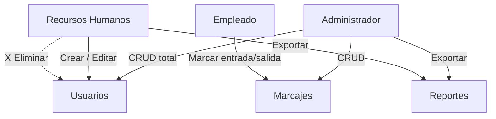

# Control de Roles y Permisos RBAC

> Diseño del control de accesos basado en roles del [[Ecosistema Sistema de Marcación]]. Se une al tejido junto a [[Módulo de Gestión de Usuarios]], [[Panel de Reportes y Auditoría]] y [[Motor de Reglas de Horas Extra]].

## Modelo de roles

La tabla `roles` se siembra automáticamente al inicializar la base:

| id | nombre | Alcance |
| --- | --- | --- |
| 1 | Administrador | Control total: crear, editar y eliminar todo |
| 2 | Recursos Humanos | Gestiona usuarios (crear/editar) pero **no** elimina |
| 3 | Empleado | Solo registra marcas de entrada/salida |



## Matriz de permisos

| Acción | Administrador | Recursos Humanos | Empleado |
| --- | :-: | :-: | :-: |
| Crear usuario | ✔ | ✔ | ✖ |
| Editar usuario | ✔ | ✔ | ✖ |
| Eliminar usuario | ✔ | ✖ | ✖ |
| Asignar rol Administrador | ✔ | ✖ | ✖ |
| Registrar marcas | ✔ | ✔ | ✔ |
| Consultar registros propios | ✔ | ✔ | ✔ |
| Exportar reportes mensuales | ✔ | ✔ | ✖ |

## Implementación

`src/auth.py` valida el rol **antes** de tocar la base de datos:

```python
def autorizado(*roles: str) -> Callable[[F], F]:
    """Decorador que exige un rol permitido al actor antes de ejecutar."""
    def decorador(func: F) -> F:
        @wraps(func)
        def envoltura(db: Database, actor: Dict, *args, **kwargs):
            require_role(db, actor, roles)          # PermissionError si no autorizado
            return func(db, actor, *args, **kwargs)
        return envoltura
    return decorador


@autorizado(ROLE_ADMIN, ROLE_RRHH)
def create_user(db, actor, username, password, full_name, role_name) -> int:
    if role_name == ROLE_ADMIN:                      # endurecimiento anti-escalada
        require_role(db, actor, (ROLE_ADMIN,))
    ...
```

## Blindaje adicional

- Solo un **Administrador** puede crear/editar a otro Administrador (evita escalada desde RRHH).
- Un usuario **no puede eliminarse a sí mismo**.
- Cada CRUD de usuarios genera un evento en `logs_auditoria` (ver [[Panel de Reportes y Auditoría]]).
- Contraseñas encriptadas con **bcrypt**, nunca en texto plano.
- `src/app.py` oculta opciones según el rol; la validación real vive en `auth.py` y `reports.py`.

## Relación con el esquema

`users.role_id` → `roles.id` (llave foránea). El rol viaja con el usuario autenticado vía `role_name` en las consultas `JOIN` de `src/database.py`.