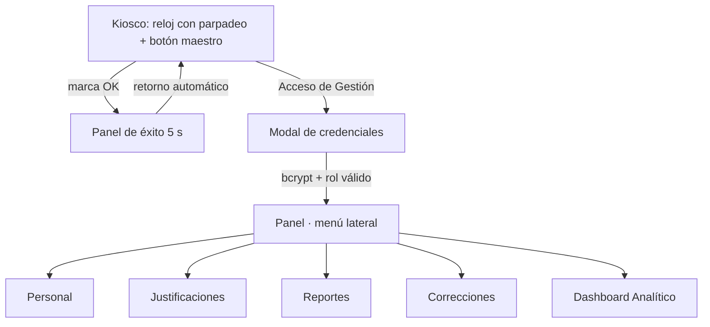

# Diseño de Interfaz Premium UI-UX

> La cara visible del sistema: un terminal de marcación de estética oscura
> de nivel comercial internacional con dos capas de uso — recepción pública
> tipo kiosco y gestión administrativa. Implementado en `src/gui.py` con
> CustomTkinter.

## Sistema de diseño v2 (elevación visual)

| Token | Valor | Uso |
| --- | --- | --- |
| `BG` | `#0B0B0C` | Fondo general gris profundo mate |
| `CARD` | `#15151A` | Tarjetas flotantes con borde fino `#1E1E24` |
| `INPUT_BG` | `#191920` | Campos de texto y listados |
| `PRIMARY` | `#1A56DB` | Botones principales; hover fluido `#2E66E8` |
| `TEXT` | `#F2F2EE` | Texto tiza principal |
| `MUTED` | `#8E8E96` | Subtítulos y ayuda |
| `SUCCESS` / `DANGER` | `#4ADE80` / `#F0544F` | Confirmaciones y errores |
| `ACCENTO` | `#F5C26B` | Destacados dorados (aguinaldo, extra 100%) |

- Tarjetas con **esquinas muy redondeadas (16 px)** y bordes finos `#1E1E24`
  que simulan profundidad y flotación (glassmorphism sutil sobre el fondo
  mate).
- Botones de acción principal: **azul eléctrico #1A56DB**, esquinas de
  8 px y `hover_color` fluido hacia `#2E66E8` para máxima interactividad.
- Tipografía: `Segoe UI` para interfaz y `Consolas` para el comprobante
  criptográfico; márgenes de 24 px.

## Modo Recepción (kiosco automatizado)

- Reloj digital de **76 px en Consolas** (espaciado uniforme) con
  **parpadeo suavizado de los dos puntos** cada 500 ms — con fuente
  monoespaciada la alternancia no desplaza el texto.
- Debajo, widget de fecha dinámico en español completo:
  *"Miércoles, 19 de agosto de 2026"*.
- **Botón maestro único "REGISTRAR ASISTENCIA"** con auto-detección de
  Entrada/Salida (Ley 213); el sistema resuelve al empleado con
  `db.get_user_by_username()` **sin solicitar contraseña** — decisión de
  diseño para un terminal público, donde la autenticación fuerte queda en
  el panel de gestión.
- Al marcar, un **panel de éxito transitorio** reemplaza el área de
  marcación: check verde grande, "¡Entrada Registrada!" o "¡Salida
  Registrada!", el **hash SHA-256** en un ticket compacto monoespaciado y
  "Volviendo a recepción…"; desaparece solo tras 5 segundos.
- El ticket permanente de cada marcación se genera con
  `reports.comprobante_marcacion()` en el pie del kiosco.
- Enlaces discretos al pie: "Consultar mis Marcas Localmente" y
  "Acceso de Gestión".

## Consulta de Asistencia

`ConsultaLocalModal` con **accesos rápidos de rango** junto al selector:

- **[Mes Actual]** · **[Últimos 3 Meses]** · **[Desde Enero]** y **[Hoy]**:
  autocompletan "Desde/Hasta" al instante y refrescan el historial y los
  gráficos sin esperas (recorte automático a enero si el trimestre cruza el
  año).
- Transición suave de opacidad al abrir el modal y validación amable del
  rango (1 de enero del año en curso → hoy).

## Modo Gestión (RRHH/Administrador)

El modal `LoginModal` valida con `auth.authenticate()` y exige rol en
`ROLES_GESTION_USUARIOS`.

El panel reemplaza las pestañas superiores por un **menú lateral
minimalista con íconos estilizados** (▦ ✦ ▤ ✎ ◉): la sección activa se
ilumina en azul eléctrico y el contenido alterna sin recargar:

1. **Personal** — alta con usuario, nombre, rol, salario y contraseña
   inicial; listado con edición y eliminación. Solo el Administrador
   gestiona Administradores.
2. **Justificaciones** — Vacaciones/Reposo/Permiso con rango de fechas,
   auditado con `aprobado_por`.
3. **Reportes** — descarga en un clic del Excel mensual y de aguinaldos.
4. **Correcciones** — bandeja de reclamos web con aprobación/rechazo y
   auditoría JSONB.
5. **Analítica** — [[Panel de Analítica Visual y UX Premium]]: tardanzas
   del mes, extras por departamento y aguinaldo proyectado.

Toda operación sensible pasa por `auth.py`, que audita en `logs_auditoria`.

## Flujo de pantallas

## Vinculación

- [[Ecosistema Sistema de Marcación]]
- [[Panel de Analítica Visual y UX Premium]]
- [[Control de Roles y Permisos RBAC]]
- [[Panel de Reportes y Auditoría]]
- [[Módulo de Gestión de Usuarios]]
- [[Despliegue en la Nube e Infraestructura SaaS]]