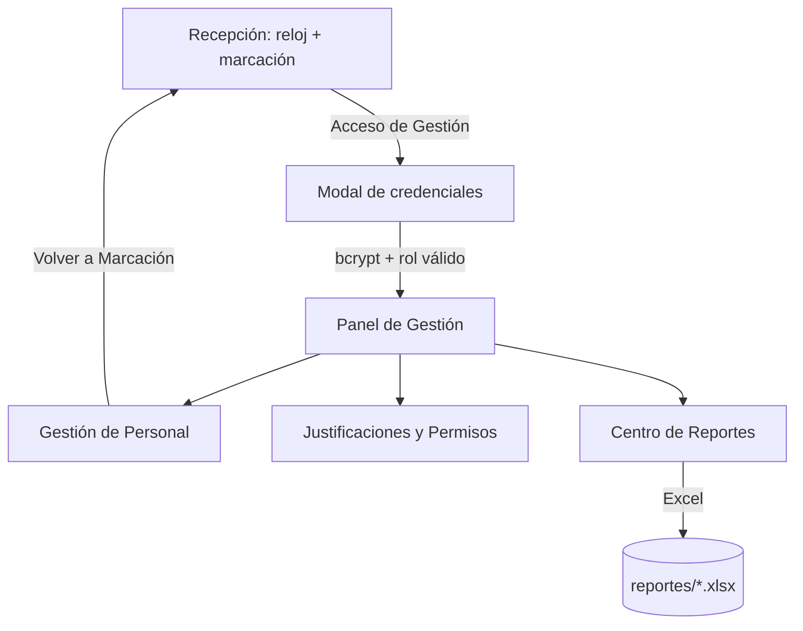

# Diseño de Interfaz Premium UI-UX

> La cara visible del sistema: un terminal de marcación de estética oscura
> profesional con dos capas de uso — recepción pública y gestión
> administrativa. Implementado en `src/gui.py` con CustomTkinter.

## Sistema de diseño

| Token | Valor | Uso |
| --- | --- | --- |
| `BG` | `#121214` | Fondo de ventana |
| `CARD` | `#1B1B1F` | Tarjetas flotantes con borde `#26262C` |
| `INPUT_BG` | `#232329` | Campos de texto y listados |
| `PRIMARY` | `#1A56DB` | Botones principales; hover `#2E66E8` |
| `TEXT` | `#F2F2EE` | Texto tiza principal |
| `MUTED` | `#8E8E96` | Subtítulos y ayuda |
| `SUCCESS` / `DANGER` | `#4ADE80` / `#F0544F` | Confirmaciones y errores |

Tipografía: `Segoe UI` para interfaz (equivalente de Inter en Windows) y
`Consolas` para el comprobante criptográfico. Radio de esquina 12 px en
tarjetas, márgenes de 24 px y transiciones suaves de color al pasar el mouse.

## Modo Recepción (kiosco)

- Reloj digital de 76 px actualizado con `after(1000)`, fecha en español.
- Marcación por cédula o usuario: el sistema resuelve al empleado con
  `db.get_user_by_username()` **sin solicitar contraseña** — decisión de
  diseño para un terminal de acceso público en recepción, donde la
  autenticación fuerte queda reservada al panel de gestión.
- Botones "Registrar Entrada" (azul) y "Registrar Salida" (contorno).
- El ticket de cada marcación se genera con
  `reports.comprobante_marcacion()` (SHA-256) y se muestra en tipografía
  monoespaciada.
- Un enlace discreto "Acceso de Gestión" al pie abre el modal de credenciales.

## Modo Gestión (RRHH/Administrador)

El modal `LoginModal` valida con `auth.authenticate()` y exige rol en
`ROLES_GESTION_USUARIOS`; los empleados de rol "Empleado" no pueden ingresar.

El panel `CTkTabview` despliega tres pestañas:

1. **Gestión de Personal** — alta con usuario, nombre, rol, salario y
   contraseña inicial; listado con "Editar" (modal con rol/salario/clave) y
   "Eliminar". Solo el Administrador puede asignar o degradar Administradores.
2. **Justificaciones y Permisos** — selección de empleado, tipo
   (Vacaciones/Reposo/Permiso) y rango de fechas; queda auditada con
   `aprobado_por`.
3. **Centro de Reportes** — descarga en un clic del Excel mensual de
   asistencia y de la proyección de aguinaldos (Ley 6380/2019).

Toda operación sensible pasa por `auth.py`, que audita en `logs_auditoria`.

## Flujo de pantallas

## Vinculación

- [[Ecosistema Sistema de Marcación]]
- [[Control de Roles y Permisos RBAC]]
- [[Panel de Reportes y Auditoría]]
- [[Módulo de Gestión de Usuarios]]