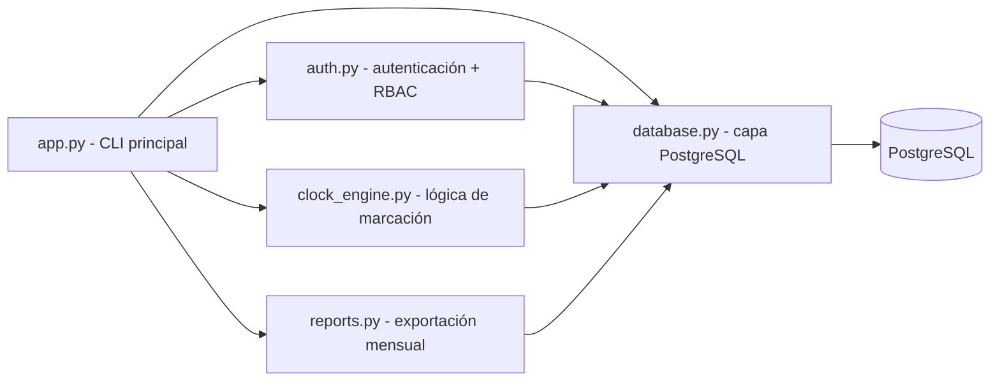

# Ecosistema Sistema de Marcación

> Mapa del tejido de software que compone el proyecto. La bóveda aloja la documentación comercial ([[AGENTS.md]]) y el repositorio Git aloja el código en `src/`.

## Arquitectura

## Módulos

| Archivo | Responsabilidad |
| --- | --- |
| `src/app.py` | Punto de entrada: menú interactivo adaptado al rol, flujo de sesión y orquestación |
| `src/auth.py` | Autenticación (PBKDF2) y control de accesos RBAC: [[Control de Roles y Permisos RBAC]] |
| `src/database.py` | Conexión PostgreSQL (psycopg2), esquema de roles, usuarios y marcajes |
| `src/clock_engine.py` | Reglas de negocio: entrada/salida, cálculo de horas trabajadas y horas extra |
| `src/reports.py` | Exportación mensual de asistencia (xlsx/csv) para contabilidad |

## Flujo de datos

1. `app.py` inicia `Database` y crea el esquema (tablas `roles`, `users`, `marcajes`).
2. `auth.py` valida credenciales contra la tabla `users` y verifica el rol.
3. `clock_engine.py` registra entradas/salidas en `marcajes`.
4. `database.py` persiste todo en PostgreSQL (credenciales desde `.env`, ignorado por Git).

## Documentación vinculada

- [[Control de Roles y Permisos RBAC]]
- [[Módulo de Gestión de Usuarios]]
- [[Motor de Reglas de Horas Extra]]
- [[Panel de Reportes y Auditoría]]

## Vinculación con el repositorio

- Raíz del repo: `C:\Proyectos\Sistema de Marcacion`
- Código: `src/` (los archivos de código viven fuera de la bóveda, en el repo Git)
- Documentación comercial: esta bóveda (`AGENTS.md` y notas)
- Lo que se publica en GitHub: `src/`, `.gitignore` y la documentación de la bóveda (`.obsidian/` queda excluido)