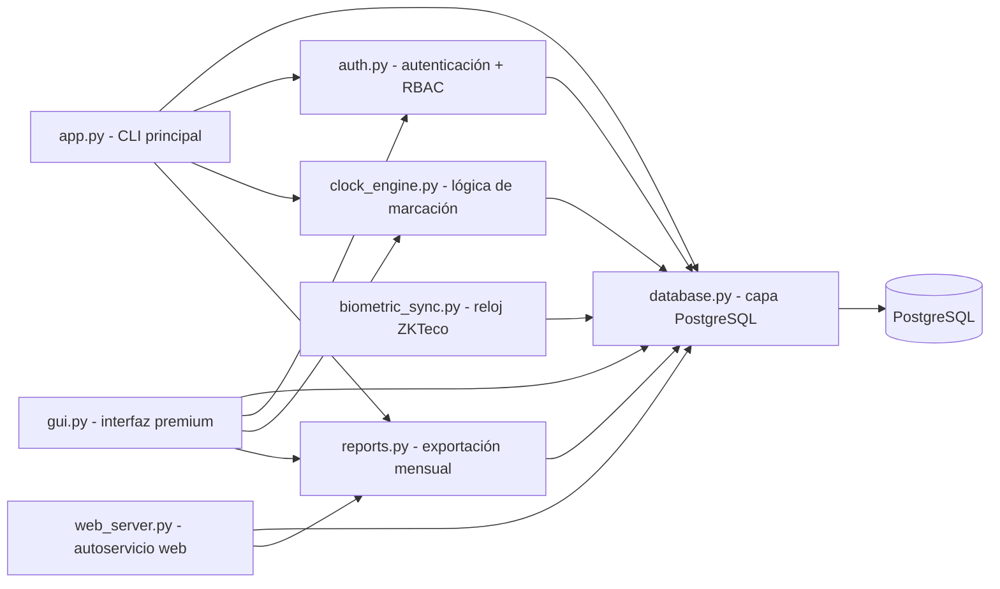

# Ecosistema Sistema de Marcación

> Mapa del tejido de software que compone el proyecto. La bóveda aloja la documentación y el repositorio Git aloja el código en `src/`. Para orientarse entre las notas, ver [[AGENTS]].

> [!warning] Estado al 2026-09-13
> La auditoría técnica registró **defectos bloqueantes** en el motor horario, el arranque del esquema y el portal web. Antes de tomar este mapa como descripción del estado deseado, leer [[Auditoría Técnica · Hallazgos Críticos]].

## Arquitectura

## Módulos

| Archivo | Responsabilidad |
| --- | --- |
| `src/app.py` | Punto de entrada: menú interactivo adaptado al rol, flujo de sesión y orquestación |
| `src/auth.py` | Autenticación (bcrypt) y control de accesos RBAC: [[Control de Roles y Permisos RBAC]] y [[Seguridad y Cifrado de Comunicaciones]] |
| `src/database.py` | Conexión PostgreSQL (psycopg2), esquema de roles, usuarios, marcajes y `logs_auditoria` |
| `src/clock_engine.py` | Reglas de negocio (Ley 213): entrada/salida, tardanzas y horas extra; cumplimiento Res. 3028/2024: [[Reglamento de Asistencia y Disciplina]] |
| `src/reports.py` | Exportación mensual de asistencia (xlsx/csv), aguinaldos y PDFs oficiales: [[Manual de Diseño UI-UX Simplificado y Reportes PDF]] |
| `src/gui.py` | Interfaz premium en CustomTkinter con temas Claro/Oscuro: [[Diseño de Interfaz Premium UI-UX]], [[Panel de Analítica Visual y UX Premium]] y [[Manual de Diseño UI-UX Simplificado y Reportes PDF]] |
| `src/web_server.py` | Autoservicio web FastAPI con tablero personal y descarga de PDFs: [[Estructura Web y Conexión Biométrica]] y [[Manual de Diseño UI-UX Simplificado y Reportes PDF]] |
| `src/reglamento.py` | Catálogo reglamentario de permisos y licencias (Res. 1307/2010 y 3028/2024) con cuotas y disponibilidad: [[Catálogo de Permisos y Licencias]] |
| `src/biometric_sync.py` | Sincronización TCP/IP con relojes ZKTeco (puerto 4370) |
| `Dockerfile` | Contenedor de producción (gunicorn + uvicorn): [[Despliegue en la Nube e Infraestructura SaaS]] |
| `solicitudes_correccion` | Tabla de reclamos de marcación fallida (Pendiente/Aprobado/Rechazado) |
| `solicitudes_permiso` | Pedidos de permiso presentados desde el portal: [[Autoservicio de Permisos y Formularios]] |
| `condiciones_dia` | Condición excepcional del día declarada por RRHH (reemplaza a la casilla del kiosco) |
| `src/biometria.py` | Cifrado AES-256-GCM de las plantillas faciales: [[Seguridad y Cifrado de Comunicaciones]] |
| `src/rate_limit.py` | Freno de intentos fallidos en login y kiosco |
| `src/turnos.py` | Definición, validación y resolución de turnos: [[Turnos y Rotación de Horarios]] |
| `empresas` | Clientes alojados en esta instalación; cada tabla de datos lleva su `empresa_id`: [[Multiempresa · Aislamiento entre Clientes]] |
| `turnos`, `turno_tramos` | Horarios de la empresa y las franjas de cada uno (la jornada partida tiene dos) |
| `asignaciones_turno` | Rotaciones con vigencia; al vencer el empleado vuelve a su turno de contrato |

## Flujo de datos

1. `app.py` inicia `Database` y crea la base y el esquema (tablas `roles`, `users`, `marcajes`, `logs_auditoria`).
2. `auth.py` valida credenciales (bcrypt), deja la conexión atada a la empresa del usuario y verifica el rol.
3. `turnos.py` resuelve qué horario rige para ese empleado ese día (rotación vigente → legajo → predeterminado).
4. `clock_engine.py` registra entradas/salidas en `marcajes` con el desglose de la Ley 213, midiendo la tardanza contra el turno resuelto y aplicando las reglas de la Res. 3028/2024.
5. `database.py` persiste todo en PostgreSQL y audita las operaciones de RRHH/Admin.

## Documentación vinculada

### Auditoría y evolución

- [[Auditoría Técnica · Hallazgos Críticos]] — registro de bugs y vulnerabilidades con severidad y corrección
- [[Arquitectura Objetivo · Plataforma y Portal del Empleado]] — separación en capas, modelo de datos faltante y rediseño del portal
- [[Antifraude y Resiliencia en Picos de Marcación]] — vectores de fraude y comportamiento bajo el pico de las 08:00
- [[Sistema de Diseño · Planilla]] — lenguaje visual compartido por la web y el escritorio
- [[Autoservicio de Permisos y Formularios]] — permisos desde el portal y documentos que se emiten solos
- [[Turnos y Rotación de Horarios]] — horarios por empleado, rotación con vigencia y jornada partida
- [[Multiempresa · Aislamiento entre Clientes]] — varios clientes en una instalación, sin datos cruzados
- [[Puesta en Marcha en un Cliente]] — instalación, secretos, carga inicial y qué no está incluido

### Módulos

- [[Bitácora de Implementación]] (historial cronológico completo)
- [[Control de Roles y Permisos RBAC]]
- [[Módulo de Gestión de Usuarios]]
- [[Motor de Reglas de Horas Extra]]
- [[Panel de Reportes y Auditoría]]
- [[Módulo de Justificaciones y Aguinaldos]]
- [[Diseño de Interfaz Premium UI-UX]]
- [[Estructura Web y Conexión Biométrica]]
- [[Seguridad y Cifrado de Comunicaciones]]
- [[Panel de Analítica Visual y UX Premium]]
- [[Despliegue en la Nube e Infraestructura SaaS]]
- [[Reglamento de Asistencia y Disciplina]]
- [[Manual de Diseño UI-UX Simplificado y Reportes PDF]]
- [[Catálogo de Permisos y Licencias]]

## Vinculación con el repositorio

- Raíz del repo: `C:\Proyectos\Sistema de Marcacion`
- Código: `src/` (los archivos de código viven fuera de la bóveda, en el repo Git)
- Documentación comercial: esta bóveda (`AGENTS.md` y notas)
- Lo que se publica en GitHub: `src/`, `.gitignore` y la documentación de la bóveda (`.obsidian/` queda excluido)