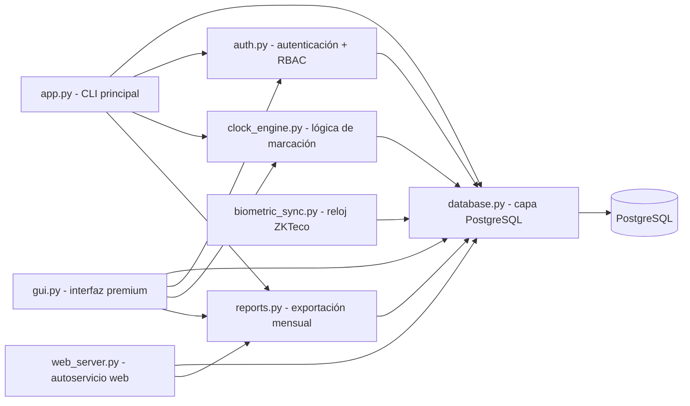

# Ecosistema Sistema de Marcación

> Mapa del tejido de software que compone el proyecto. La bóveda aloja la documentación comercial ([[AGENTS.md]]) y el repositorio Git aloja el código en `src/`.

## Arquitectura

## Módulos

| Archivo | Responsabilidad |
| --- | --- |
| `src/app.py` | Punto de entrada: menú interactivo adaptado al rol, flujo de sesión y orquestación |
| `src/auth.py` | Autenticación (bcrypt) y control de accesos RBAC: [[Control de Roles y Permisos RBAC]] y [[Seguridad y Cifrado de Comunicaciones]] |
| `src/database.py` | Conexión PostgreSQL (psycopg2), esquema de roles, usuarios, marcajes y `logs_auditoria` |
| `src/clock_engine.py` | Reglas de negocio (Ley 213): entrada/salida, tardanzas y horas extra; cumplimiento CONATEL Res. 3028/2024: [[Reglamento de Asistencia y Disciplina CONATEL]] |
| `src/reports.py` | Exportación mensual de asistencia (xlsx/csv), aguinaldos y PDFs oficiales CONATEL: [[Manual de Diseño UI-UX Simplificado y Reportes PDF]] |
| `src/gui.py` | Interfaz premium en CustomTkinter con temas Claro/Oscuro: [[Diseño de Interfaz Premium UI-UX]], [[Panel de Analítica Visual y UX Premium]] y [[Manual de Diseño UI-UX Simplificado y Reportes PDF]] |
| `src/web_server.py` | Autoservicio web FastAPI con tablero personal y descarga de PDFs: [[Estructura Web y Conexión Biométrica]] y [[Manual de Diseño UI-UX Simplificado y Reportes PDF]] |
| `src/biometric_sync.py` | Sincronización TCP/IP con relojes ZKTeco (puerto 4370) |
| `Dockerfile` | Contenedor de producción (gunicorn + uvicorn): [[Despliegue en la Nube e Infraestructura SaaS]] |
| `solicitudes_correccion` | Tabla de reclamos de marcación fallida (Pendiente/Aprobado/Rechazado) |

## Flujo de datos

1. `app.py` inicia `Database` y crea la base y el esquema (tablas `roles`, `users`, `marcajes`, `logs_auditoria`).
2. `auth.py` valida credenciales (bcrypt) contra la tabla `users` y verifica el rol.
3. `clock_engine.py` registra entradas/salidas en `marcajes` con el desglose de la Ley 213 y las reglas de tolerancia de la Res. 3028/2024 de CONATEL.
4. `database.py` persiste todo en PostgreSQL y audita las operaciones de RRHH/Admin.

## Documentación vinculada

- [[Control de Roles y Permisos RBAC]]
- [[Módulo de Gestión de Usuarios]]
- [[Motor de Reglas de Horas Extra]]
- [[Panel de Reportes y Auditoría]]
- [[Módulo de Justificaciones y Aguinaldos]]
- [[Diseño de Interfaz Premium UI-UX]]
- [[Estructura Web y Conexión Biométrica]]
- [[Seguridad y Cifrado de Comunicaciones]]
- [[Panel de Analítica Visual y UX Premium]]
- [[Despliegue en la Nube e Infraestructura SaaS]]
- [[Reglamento de Asistencia y Disciplina CONATEL]]
- [[Manual de Diseño UI-UX Simplificado y Reportes PDF]]

## Vinculación con el repositorio

- Raíz del repo: `C:\Proyectos\Sistema de Marcacion`
- Código: `src/` (los archivos de código viven fuera de la bóveda, en el repo Git)
- Documentación comercial: esta bóveda (`AGENTS.md` y notas)
- Lo que se publica en GitHub: `src/`, `.gitignore` y la documentación de la bóveda (`.obsidian/` queda excluido)