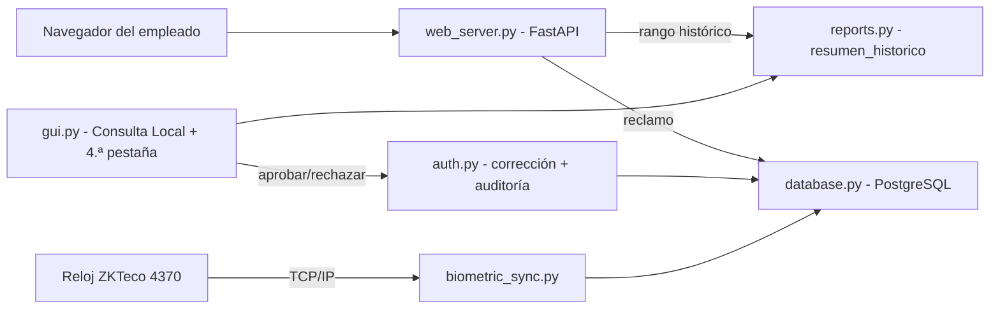

# Estructura Web y Conexión Biométrica

> La capa SaaS del sistema: un autoservicio web ligero para que cada
> empleado consulte su historial desde el navegador, un puente TCP/IP
> hacia los relojes biométricos ZKTeco de la industria para sincronizar
> identidades con PostgreSQL y la bandeja de reclamos que alimenta a
> Recursos Humanos.

## Servidor web de consulta y reclamos (`src/web_server.py`)

Servidor independiente con FastAPI + uvicorn en `127.0.0.1:8000`:

- **Página única responsiva** con el Modo Oscuro Premium (#121214) y
  `Segoe UI`, optimizada con media queries para celulares y PC.
- **Filtros de rango histórico**: el botón inteligente **"Hoy"** captura la
  fecha local del equipo en ambos extremos, o el empleado elige libremente
  'Desde' y 'Hasta' (por ejemplo, 1 de enero hasta hoy) para revisar de
  golpe todo su historial de marcas, horas extra 50%/100% y el aguinaldo
  devengado en el período (Ley N.º 6380/2019).
- **`POST /api/consulta`**: endpoint de solo lectura que resuelve al
  empleado por username y delega en `reports.resumen_historico()`, con
  consulta indexada sobre `(user_id, hora_entrada)`; mantiene compatibilidad
  con la consulta puntual de un día.
- **`POST /api/reclamo`**: formulario limpio de **Solicitud de Corrección**
  (tipo de marca, fecha del incidente, hora propuesta y motivo) para cuando
  el empleado olvidó marcar o el sensor biométrico falló. Queda en estado
  `Pendiente` en la tabla `solicitudes_correccion` y solo RRHH/Admin puede
  resolverla desde el panel de gestión.
- Seguridad por diseño: las consultas son de solo lectura; no expone
  credenciales ni información de otros empleados; cada petición abre y
  cierra su propia conexión (`Database.cerrar()`).

## Bandeja de aprobaciones (escritorio)

La cuarta pestaña del panel oculto de Admin/RRHH lista los reclamos web con
botones **Aprobar / Rechazar**. Al aprobar, `auth.aprobar_solicitud_correccion()`
materializa la marca propuesta en `marcajes` (crea o ajusta la entrada,
cierra la salida abierta con el desglose legal) y traza tanto el cambio de
marcaje como el estado de la solicitud en `logs_auditoria` con valores
anterior/nuevo en JSONB.

## Incidencias de marcación (Ley N.º 213)

`clock_engine.py` clasifica cada marcaje con `tipo_incidencia`:

- **Llegada Tardía**: la entrada supera la gracia de 10 minutos.
- **Salida Anticipada**: el marcaje se cierra antes de completar las
  8 horas de jornada diurna en un día laborable.
- Ambas pueden convivir: `Llegada Tardía y Salida Anticipada`.

## Sincronización biométrica (`src/biometric_sync.py`)

Simulación fiel del diálogo TCP/IP con un reloj biométrico **ZKTeco**
(puerto 4370):

- Paquete de cabecera de 16 bytes del SDK (comando, checksum, sesión,
  réplica) y comandos canónicos de la industria (`CMD_READ_ALL_USER_ID`).
- `RelojBiometricoZKTeco` gestiona conexión, transacciones y lectura exacta
  de bloques de plantillas (72 bytes por registro).
- `sincronizar_empleados()` empareja cada ID biométrico con la cédula
  (`username`) y persiste la asociación en `users.biometrico_id` (índice
  único parcial).
- Sin hardware físico, `--simular` genera una descarga de prueba sin tocar
  la red; el modo real falla con un mensaje claro si no hay dispositivo.

## Vinculación

- [[Ecosistema Sistema de Marcación]]
- [[Diseño de Interfaz Premium UI-UX]]
- [[Panel de Reportes y Auditoría]]
- [[Módulo de Gestión de Usuarios]]
- [[Motor de Reglas de Horas Extra]]