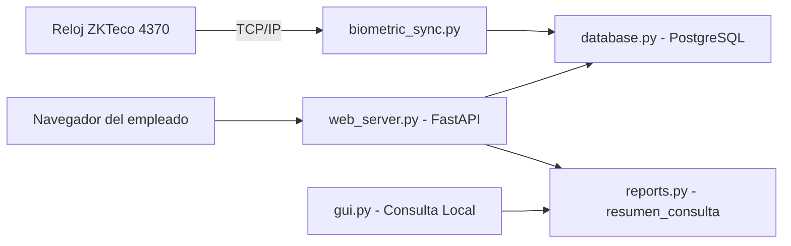

# Estructura Web y Conexión Biométrica

> La capa SaaS del sistema: un autoservicio web ligero para que cada
> empleado consulte su historial desde el navegador y un puente TCP/IP
> hacia los relojes biométricos ZKTeco de la industria para sincronizar
> identidades con PostgreSQL.

## Servidor web de consulta (`src/web_server.py`)

Servidor independiente con FastAPI + uvicorn en `127.0.0.1:8000`:

- **Página única responsiva** con el Modo Oscuro Premium (#121214) y
  `Segoe UI`, optimizada con media queries para celulares y PC.
- **Autoservicio transparente**: el empleado digita su cédula y pulsa el
  botón inteligente **"Hoy"** (JavaScript captura la fecha local) para ver
  al instante sus marcas del día, las horas extra acumuladas del mes y su
  aguinaldo proporcional (Ley N.º 6380/2019).
- **`POST /api/consulta`**: endpoint de solo lectura que resuelve al
  empleado por username y delega en `reports.resumen_consulta()`, el mismo
  motor que alimenta la consulta local del escritorio.
- Seguridad por diseño: no registra marcajes, no expone credenciales ni
  información de otros empleados; la autenticación fuerte queda en el panel
  de gestión.

## Sincronización biométrica (`src/biometric_sync.py`)

Simulación fiel del diálogo TCP/IP con un reloj biométrico **ZKTeco**
(puerto 4370):

- Paquete de cabecera de 16 bytes del SDK (comando, checksum, sesión,
  réplica) y comandos canónicos de la industria (`CMD_READ_ALL_USER_ID`).
- `RelojBiometricoZKTeco` gestiona conexión, transacciones y lectura exacta
  de bloques de plantillas (72 bytes por registro).
- `sincronizar_empleados()` empareja cada ID biométrico con la cédula
  (`username`) y persiste la asociación en `users.biometrico_id` (índice
  único parcial).
- Sin hardware físico, `--simular` genera una descarga de prueba sin tocar
  la red; el modo real falla con un mensaje claro si no hay dispositivo.

## Vinculación

- [[Ecosistema Sistema de Marcación]]
- [[Diseño de Interfaz Premium UI-UX]]
- [[Panel de Reportes y Auditoría]]
- [[Módulo de Gestión de Usuarios]]
- [[Motor de Reglas de Horas Extra]]