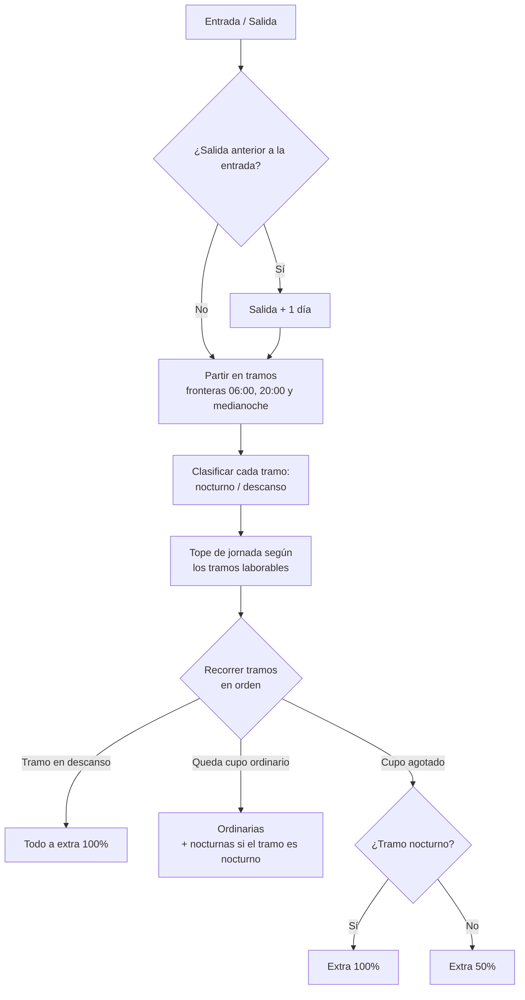

# Motor de Reglas de Horas Extra

> Núcleo de cálculo del [[Ecosistema Sistema de Marcación]]: liquida cada turno según el Código del Trabajo de Paraguay (Ley N.º 213). Reescrito el **2026-09-14** para corregir los cuatro errores de liquidación que registró la [[Auditoría Técnica · Hallazgos Críticos]] (P1-3 a P1-5 y P2-3).

## El principio que ordena todo

Un turno no es una cosa homogénea. El motor lo **parte en tramos** y liquida cada uno por separado, porque dos cosas pueden cambiar a mitad de la jornada:

- **La naturaleza del tramo**: diurno (06:00 a 20:00) o nocturno (20:00 a 06:00).
- **El día calendario**: cruzar la medianoche puede entrar a un domingo o feriado.

Las fronteras son, entonces, las **06:00, las 20:00 y la medianoche**.

Lo que **no** se decide por tramo es el tope de jornada ordinaria: ese se fija una sola vez para todo el turno. Confundir ambas cosas era el error de fondo del motor anterior.

## Reglas implementadas

| Concepto | Regla | Artículo |
| --- | --- | --- |
| Jornada diurna | Máximo 8 h ordinarias | Art. 194 |
| Jornada nocturna | Máximo 7 h ordinarias | Art. 194 |
| Jornada mixta | Máximo 7 h 30 ordinarias | Art. 194 |
| Mixta que se vuelve nocturna | Si el tramo nocturno alcanza **5 h**, toda la jornada se reputa nocturna (tope 7 h) | Art. 194 |
| Recargo nocturno | Hora **ordinaria** nocturna: **+30 %** | Art. 232 |
| Extra diurna | +50 % | Art. 234 |
| Extra nocturna | +100 % | Art. 234 |
| Domingo o feriado | +100 %, **solo sobre los tramos que caen en ese día** | Art. 233 |

Las horas ordinarias se asignan en **orden cronológico**: son las primeras efectivamente trabajadas y todo lo que excede el tope es extraordinario.

## Algoritmo



## Qué devuelve

`calcular_horas_paraguay` retorna un `DesgloseJornada` en lugar de un diccionario suelto:

```python
@dataclass(frozen=True)
class DesgloseJornada:
    horas_ordinarias: timedelta   # diurnas + nocturnas ordinarias
    horas_nocturnas: timedelta    # subconjunto de las ordinarias, recargo 30%
    horas_extra_50: timedelta
    horas_extra_100: timedelta
    tipo_jornada: str             # Diurna | Nocturna | Mixta | Descanso
    toca_descanso: bool
```

`horas_nocturnas` **no se suma** a las ordinarias: las identifica dentro de ellas, para que la nómina aplique el +30 % sin contar la hora dos veces. Se persiste en la columna homónima de `marcajes`, junto con `tipo_jornada`, que deja la liquidación explicable ante un reclamo.

## Ejemplos verificados

Salida real del motor, cubierta por `tests/test_motor_horario.py`:

| Turno | Tipo | Ordinarias | Nocturnas | Extra 50% | Extra 100% |
| --- | --- | --- | --- | --- | --- |
| 08:00–17:00 martes | Diurna | 8:00 | 0:00 | 1:00 | 0:00 |
| 06:00–21:00 | Mixta | 7:30 | 0:00 | 6:30 | 1:00 |
| 07:00–22:00 | Mixta | 7:30 | 0:00 | 5:30 | 2:00 |
| 20:00–06:00 | Nocturna | 7:00 | **7:00** | 0:00 | 3:00 |
| 17:00–02:00 | Nocturna | 7:00 | **4:00** | 0:00 | 2:00 |
| Sábado 22:00 → domingo 06:00 | Nocturna | 2:00 | **2:00** | 0:00 | **6:00** |
| Domingo 22:00 → lunes 06:00 | Nocturna | 6:00 | **6:00** | 0:00 | **2:00** |
| Domingo 08:00–17:00 | Descanso | 0:00 | 0:00 | 0:00 | 9:00 |

Las dos filas que cruzan el domingo son la diferencia más cara: el motor anterior liquidaba el turno entero según el día de **entrada**, así que regalaba seis horas de recargo en un sentido y las cobraba de más en el otro.

> [!note] Jornada nocturna sin horas nocturnas
> En el turno 17:00–02:00 las 6 h nocturnas reputan nocturna toda la jornada (tope 7 h), pero como las ordinarias se consumen cronológicamente, 3 h caen en el tramo diurno. Solo 4 h llevan el recargo del 30 %. Es correcto: el tipo de jornada fija el tope, no qué horas recibieron recargo.

## Tolerancia de llegada

La hora contra la que se mide el retraso sale del **turno** del empleado, no de una constante del proceso:

```python
turno = turno_vigente(db, usuario_id, instante.date())
prevista = turno.entrada_prevista(hora_marca, tramos_consumidos(db, usuario_id, instante))
retraso = max(timedelta(0), hora_marca - prevista)
```

| Tolerancia | Minutos | Fuente |
| --- | --- | --- |
| Funcionario | 15 | Gracia general |
| Pasante | 10, hasta 3 veces al mes | Res. 3028/2024 |
| Propia del turno | la que declare | Desplaza a la del vínculo |
| Condición del día | la que declare RRHH | Se **suma** a la vigente |

Fuera de los días que cubre el turno no hay hora a la cual llegar tarde: la marca se registra y se liquida, pero no genera incidencia. El diseño completo está en [[Turnos y Rotación de Horarios]], que cerró P2-4 y P2-5.

## Calendario de feriados

Ya no es una lista fija que vence en diciembre. `feriados_de(anio)` compone el calendario de cualquier año a partir de tres fuentes:

1. **Feriados de fecha fija** (Año Nuevo, 1 de mayo, Independencia, Caacupé, Navidad, etc.).
2. **Derivados de la Pascua**: Jueves y Viernes Santo, por el algoritmo gregoriano anónimo. Para 2026 arroja el 2 y 3 de abril, las mismas fechas que la lista anterior traía cargadas a mano.
3. **Traslados decretados**, en `FERIADOS_TRASLADADOS`. Paraguay mueve varios feriados por decreto año a año; sin el decreto cargado el feriado queda en su fecha estatutaria, que es lo correcto a falta de norma en contrario.

> [!tip] Mantenimiento anual
> Publicado el decreto de traslados, agregar la entrada del año en `FERIADOS_TRASLADADOS`. Es la única tarea anual que queda, y su ausencia ya no deja al sistema ciego: solo ubica el feriado en su fecha original.

## Un solo punto de escritura

El cierre en línea, la sincronización offline y la corrección aprobada por RRHH liquidaban por su cuenta y **ya habían divergido entre sí**. Ahora las tres convergen en `persistir_desglose()`, de modo que no puedan volver a separarse.

## Persistencia

`marcajes` guarda `horas_ordinarias`, `horas_nocturnas`, `horas_extra_50`, `horas_extra_100` (tipo `INTERVAL`) y `tipo_jornada`. El recargo nocturno se propaga al aguinaldo (`reports.calcular_aguinaldo` y `aguinaldo_periodo`): la hora ordinaria nocturna ya está en el salario, así que se suma únicamente su 30 %.

## Enlaces

[[Turnos y Rotación de Horarios]] · [[Auditoría Técnica · Hallazgos Críticos]] · [[Panel de Reportes y Auditoría]] · [[Reglamento de Asistencia y Disciplina]] · [[Módulo de Justificaciones y Aguinaldos]] · [[Ecosistema Sistema de Marcación]]
