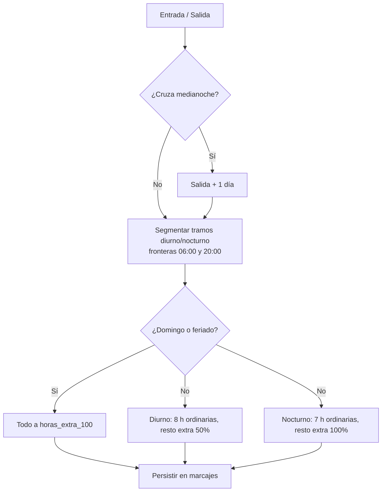

# Motor de Reglas de Horas Extra

> Núcleo de cálculo del [[Ecosistema Sistema de Marcación]]: aplica las jornadas y recargos del Código del Trabajo de Paraguay (Ley N.º 213) y la tolerancia de llegada a cada marcaje.

## Reglas implementadas

| Rango | Horario | Jornada ordinaria | Exceso se liquida como |
| --- | --- | --- | --- |
| Diurno | 06:00 a 20:00 hs | 8 horas diarias | `horas_extra_50` (recargo 50%) |
| Nocturno | 20:00 a 06:00 hs | 7 horas diarias | `horas_extra_100` (recargo 100%) |
| Domingo / feriado | Todo el día | Sin jornada ordinaria | `horas_extra_100` (recargo 100%) |
| Tolerancia | Entrada | 10 minutos de gracia | `es_tardanza = FALSE` si se marca antes del límite |

## Algoritmo



## Núcleo de la función

```python
def calcular_horas_paraguay(
    hora_entrada: datetime, hora_salida: datetime, es_feriado: bool
) -> Dict[str, timedelta]:
    """Desglose legal de un turno según la Ley N.º 213."""
    if hora_salida < hora_entrada:               # turno nocturno que cruza medianoche
        hora_salida += timedelta(days=1)
    if hora_salida - hora_entrada > timedelta(hours=24):
        raise ValueError("El turno no puede superar las 24 horas.")
    diurno, nocturno = _desglose_por_rangos(hora_entrada, hora_salida)
    if es_feriado:
        return {"horas_ordinarias": timedelta(0),
                "horas_extra_50": timedelta(0),
                "horas_extra_100": diurno + nocturno}
    ordinarias_d = min(diurno, JORNADA_DIURNA)   # máx 8 h diurnas
    ordinarias_n = min(nocturno, JORNADA_NOCTURNA)  # máx 7 h nocturnas
    return {"horas_ordinarias": ordinarias_d + ordinarias_n,
            "horas_extra_50": diurno - ordinarias_d,
            "horas_extra_100": nocturno - ordinarias_n}
```

## Tolerancia de llegada

```python
TOLERANCIA_ENTRADA: timedelta = timedelta(minutes=10)   # gracia antes de tardanza
INICIO_JORNADA: time = _cargar_inicio_jornada()         # env JORNADA_INICIO (HH:MM)

def es_tardanza(hora_entrada: datetime) -> bool:
    """Aplica la gracia de 10 minutos: tardanza solo si supera el límite."""
    return hora_entrada.time() > LIMITE_TARDANZA
```

- La hora de inicio de jornada es configurable vía `.env` (`JORNADA_INICIO=08:00`).
- Marcar a las 08:09 → **no** es tardanza; a las 08:10 tampoco (gracia); a las 08:11 → sí.
- El estado se persiste en `marcajes.es_tardanza` y aparece en reportes.

## Ejemplos de cálculo

| Turno | Diurnas | Nocturnas | Ordinarias | Extra 50% | Extra 100% |
| --- | --- | --- | --- | --- | --- |
| 08:00–20:00 | 12:00 | 0:00 | 8:00 | 4:00 | 0:00 |
| 20:00–06:00 (cruza medianoche) | 0:00 | 10:00 | 7:00 | 0:00 | 3:00 |
| 07:00–22:00 (mixto) | 13:00 | 2:00 | 10:00 | 5:00 | 0:00 |
| Feriado 08:00–17:00 | 9:00 | 0:00 | 0:00 | 0:00 | 9:00 |

## Feriados oficiales de Paraguay 2026

1 Ene · 9 Feb (Héroes, móvil) · 2 y 3 Abr (Semana Santa) · 1 May · 14 y 15 May (Independencia) · 8 Jun (Paz del Chaco, móvil) · 10 Ago (Fundación de Asunción, móvil) · 28 Sep (Boquerón, móvil) · 8 Dic (Caacupé) · 25 Dic.

- La lista vive en `FERIADOS_PARAGUAY_2026` (`src/clock_engine.py`) y **se actualiza cada año**.
- El domingo se detecta automáticamente; el flag `es_feriado` se define por la fecha de **entrada** y queda auditado.

## Persistencia

`ClockEngine.clock_out` calcula el desglose y lo guarda en `marcajes.horas_ordinarias`, `horas_extra_50` y `horas_extra_100` (tipo `INTERVAL`), listo para [[Panel de Reportes y Auditoría]].