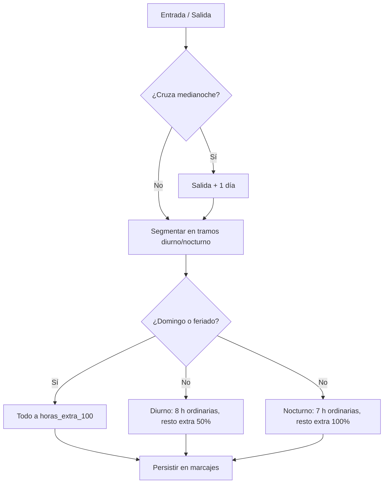

# Motor de Reglas de Horas Extra

> Núcleo de cálculo del [[Ecosistema Sistema de Marcación]]: aplica las jornadas y recargos del Código del Trabajo de Paraguay (Ley 213/93) a cada marcaje.

## Reglas implementadas (Código del Trabajo PY)

| Rango | Horario | Jornada ordinaria | Exceso se liquida como |
| --- | --- | --- | --- |
| Diurno | 06:00 a 20:00 hs | 8 horas diarias | `horas_extra_50` (recargo 50%) |
| Nocturno | 20:00 a 06:00 hs | 7 horas diarias | `horas_extra_100` (recargo 100%) |
| Domingo / feriado | Todo el día | Sin jornada ordinaria | `horas_extra_100` (recargo 100%) |

## Algoritmo (`calcular_horas_paraguay`)

1. Si la salida es anterior a la entrada (turno nocturno que cruza la medianoche), se suma un día a la salida.
2. El turno se segmenta en tramos diurnos y nocturnos en las fronteras de 06:00 y 20:00.
3. Si el día es feriado o domingo: **todo** el tiempo va a `horas_extra_100`.
4. Si no: las primeras 8 h diurnas y 7 h nocturnas son ordinarias; el resto va a `horas_extra_50` (diurno) o `horas_extra_100` (nocturno).

## Ejemplos de cálculo

| Turno | Horas diurnas | Horas nocturnas | Ordinarias | Extra 50% | Extra 100% |
| --- | --- | --- | --- | --- | --- |
| 08:00–20:00 | 12:00 | 0:00 | 8:00 | 4:00 | 0:00 |
| 20:00–06:00 | 0:00 | 10:00 | 7:00 | 0:00 | 3:00 |
| 07:00–22:00 | 13:00 | 2:00 | 10:00 | 5:00 | 0:00 |
| Feriado 08:00–17:00 | 9:00 | 0:00 | 0:00 | 0:00 | 9:00 |

## Feriados oficiales de Paraguay 2026

1 Ene (Año Nuevo) · 9 Feb (Héroes, móvil) · 2 y 3 Abr (Jueves y Viernes Santo) · 1 May (Trabajadores) · 14 y 15 May (Independencia) · 8 Jun (Paz del Chaco, móvil) · 10 Ago (Fundación de Asunción, móvil) · 28 Sep (Boquerón, móvil) · 8 Dic (Caacupé) · 25 Dic (Navidad).

- La lista vive en `FERIADOS_PARAGUAY_2026` (`src/clock_engine.py`) y **debe actualizarse cada año**.
- El domingo se detecta automáticamente (`es_feriado_o_domingo`); la empresa puede ampliar la lista con feriados locales.
- El flag `es_feriado` de cada marcaje se define según la fecha de la **entrada** y queda auditado en la tabla `marcajes`.

## Persistencia

Al cerrar el marcaje, `ClockEngine.clock_out` calcula el desglose y lo guarda en `marcajes.horas_ordinarias`, `marcajes.horas_extra_50` y `marcajes.horas_extra_100` (tipo `INTERVAL`), listo para [[Panel de Reportes y Auditoría]].