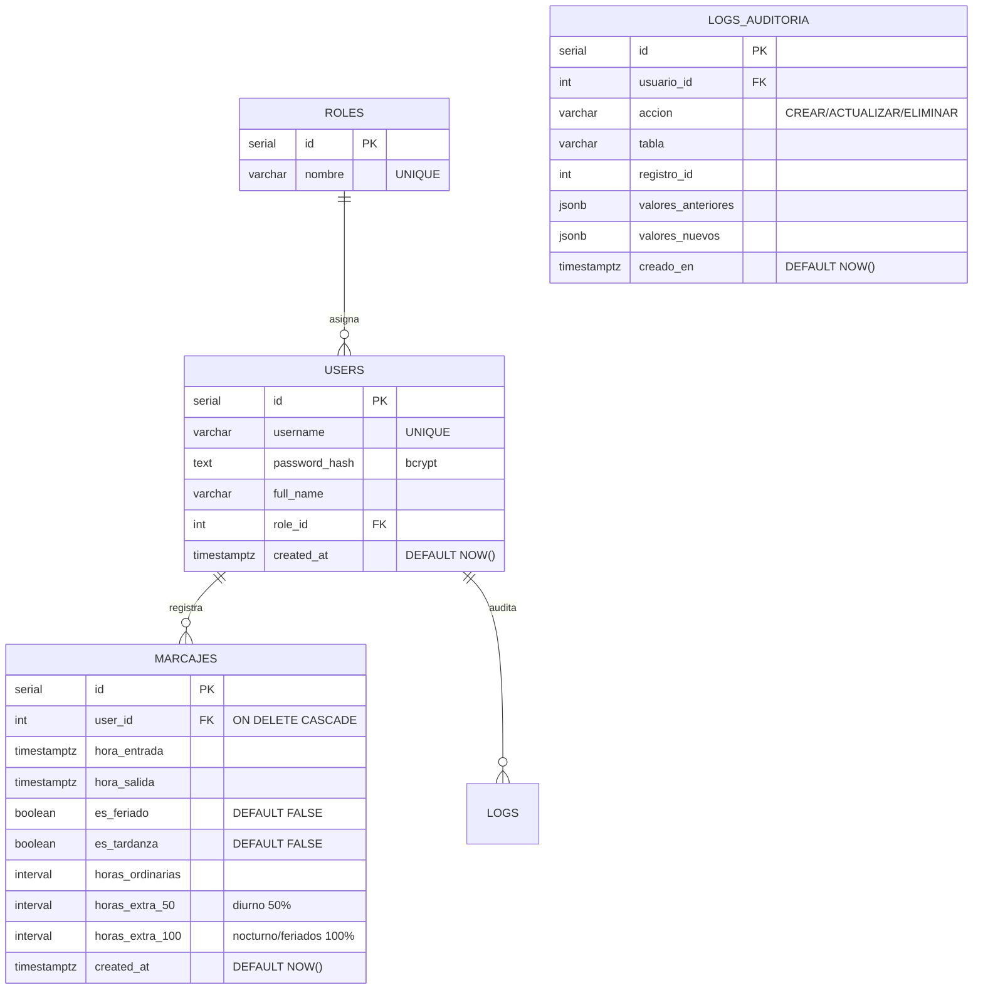

# Módulo de Gestión de Usuarios

> Diseño del módulo de usuarios sobre PostgreSQL, parte del [[Ecosistema Sistema de Marcación]]. Complementa a [[Control de Roles y Permisos RBAC]] y alimenta [[Panel de Reportes y Auditoría]].

## Esquema relacional en PostgreSQL



## Seguridad de contraseñas (bcrypt)

```python
def hash_password(password: str) -> str:
    """Encripta la contraseña con bcrypt y retorna el hash en texto seguro."""
    return bcrypt.hashpw(password.encode("utf-8"), bcrypt.gensalt()).decode("utf-8")


def verify_password(password: str, stored: str) -> bool:
    """Verifica la contraseña contra un hash bcrypt almacenado."""
    return bcrypt.checkpw(password.encode("utf-8"), stored.encode("utf-8"))
```

- bcrypt embebe la **sal aleatoria** en el propio hash; no hay que guardarla aparte.
- Los hashes **nunca** se almacenan en texto plano en PostgreSQL.
- Los valores sensibles se excluyen de los snapshots de auditoría.

## Auditoría de operaciones

Cada operación de RRHH/Administrador queda registrada en `logs_auditoria`:

| Operación | Acción registrada | Valores |
| --- | --- | --- |
| Crear usuario | `CREAR` | nuevos |
| Editar usuario | `ACTUALIZAR` | anterior + nuevos |
| Eliminar usuario | `ELIMINAR` | anteriores |

```python
db.registrar_auditoria(
    actor["id"],              # quién lo hizo
    "ACTUALIZAR",             # qué cambió
    "users",
    user_id,                  # registro afectado
    anterior=_valores_auditoria(target),   # valor previo
    nuevos=_valores_auditoria(actualizado) # valor posterior
)
```

## Operaciones por rol (RBAC)

| Operación | Función (`src/auth.py`) | Roles permitidos |
| --- | --- | --- |
| Crear usuario | `create_user` | Administrador, RRHH |
| Editar usuario | `update_user` | Administrador, RRHH |
| Eliminar usuario | `delete_user` | Administrador |
| Asignar rol Administrador | `create_user` / `update_user` | Solo Administrador |

## Conexión

Las credenciales se leen del archivo `.env` (`DB_HOST`, `DB_PORT`, `DB_NAME`, `DB_USER`, `DB_PASSWORD`), cargado por `src/database.py` y bloqueado por `.gitignore`. Si la base `marcacion` no existe y el usuario tiene permisos, el script la crea automáticamente.

## Notas relacionadas

- [[Motor de Reglas de Horas Extra]] — desglose legal que se persiste en `marcajes`.
- [[Panel de Reportes y Auditoría]] — exportación mensual y trazabilidad.