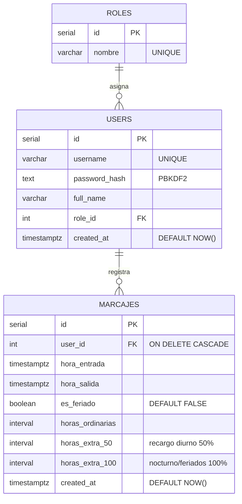

# Módulo de Gestión de Usuarios

> Diseño del módulo de usuarios sobre PostgreSQL, parte del [[Ecosistema Sistema de Marcación]]. Complementa a [[Control de Roles y Permisos RBAC]].

## Esquema relacional en PostgreSQL

## Tabla `users`

| Campo | Tipo | Restricción | Descripción |
| --- | --- | --- | --- |
| `id` | SERIAL | PRIMARY KEY | Identificador único |
| `username` | VARCHAR(100) | UNIQUE NOT NULL | Nombre de acceso |
| `password_hash` | TEXT | NOT NULL | Hash PBKDF2 (sal + digest, formato `sal:digest`) |
| `full_name` | VARCHAR(200) | NOT NULL | Nombre completo |
| `role_id` | INTEGER | FK → `roles.id` | Rol asignado (Administrador / RRHH / Empleado) |
| `created_at` | TIMESTAMPTZ | DEFAULT NOW() | Fecha de alta |

## Seguridad de contraseñas

- Hash PBKDF2-SHA256 con sal aleatoria de 16 bytes y 100 000 iteraciones (`src/auth.py`).
- Las contraseñas nunca se almacenan en texto plano.
- Verificación con comparación en tiempo constante (`hmac.compare_digest`) para evitar ataques de temporización.

## Operaciones por rol (RBAC)

| Operación | Función (`src/auth.py`) | Roles permitidos |
| --- | --- | --- |
| Crear usuario | `create_user` | Administrador, RRHH |
| Editar usuario | `update_user` | Administrador, RRHH |
| Eliminar usuario | `delete_user` | Administrador |
| Asignar rol Administrador | `create_user` / `update_user` | Solo Administrador |

## Flujo de creación

1. `app.py` pide datos (usuario, nombre, rol, contraseña).
2. `auth.create_user` valida el rol del actor mediante `require_role`.
3. Verifica que el rol destino exista en `roles` y que el `username` no esté duplicado.
4. Genera el hash PBKDF2 y ejecuta el `INSERT` contra PostgreSQL (`src/database.py`).

## Conexión

Las credenciales de PostgreSQL se leen desde el archivo `.env` (`DB_NAME`, `DB_USER`, `DB_PASSWORD`, `DB_HOST`, `DB_PORT`), cargado automáticamente por `src/database.py` y bloqueado por `.gitignore`.

## Notas relacionadas

- [[Motor de Reglas de Horas Extra]] — cálculo del desglose horario que se persiste en `marcajes`.
- [[Panel de Reportes y Auditoría]] — exportación mensual de los marcajes para contabilidad.