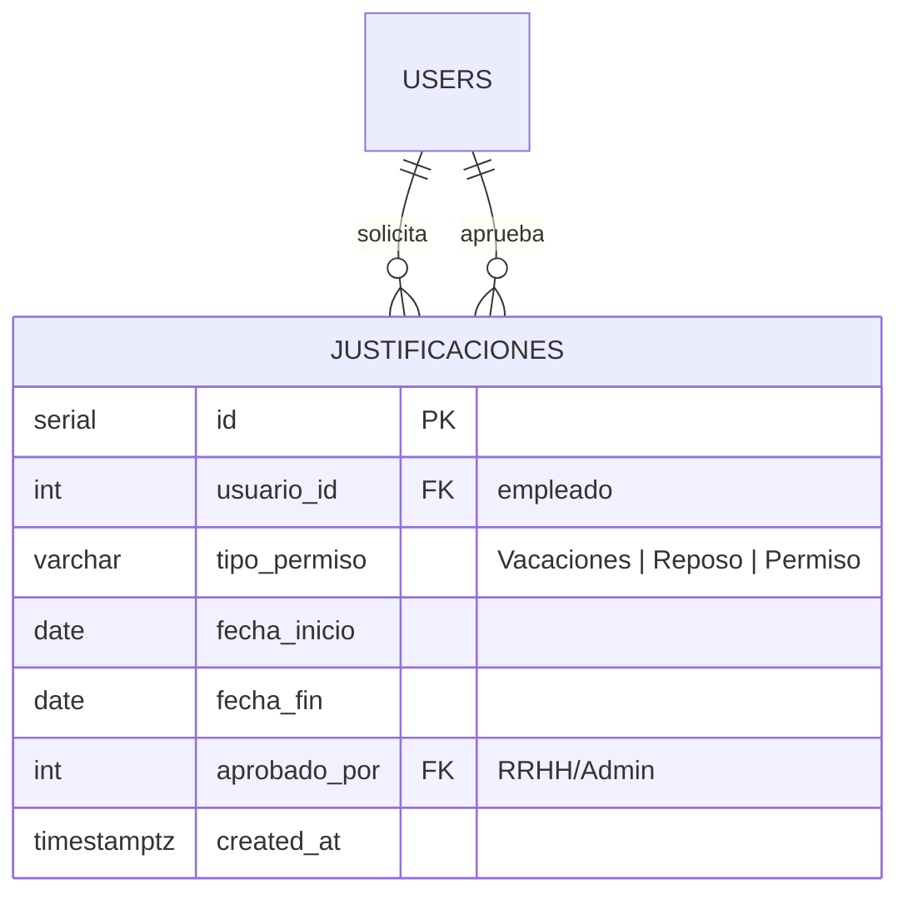
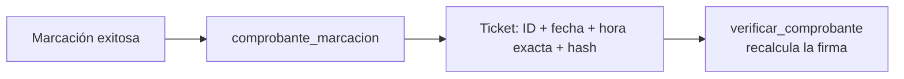
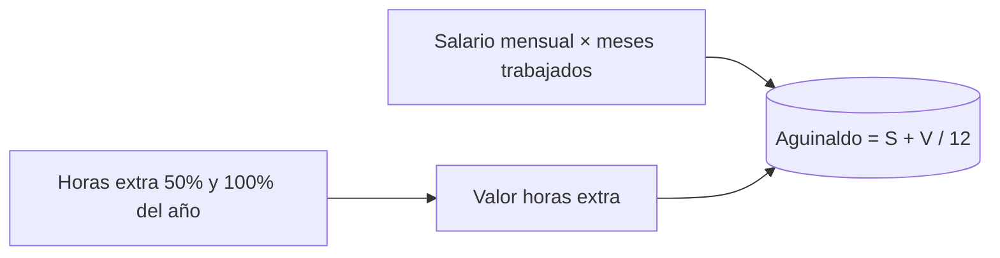

# Módulo de Justificaciones y Aguinaldos

> Pilares de negocio que cierran el [[Ecosistema Sistema de Marcación]]: ausencias con respaldo legal, comprobantes con fidelidad digital y proyección del 13.º salario según la ley paraguaya.

## 1. Justificaciones (ausencias con respaldo)

La tabla `justificaciones` documenta permisos **aprobados** por RRHH/Administrador:



| Regla | Comportamiento |
| --- | --- |
| Tipos válidos | `Vacaciones`, `Reposo`, `Permiso` (CHECK en BD) |
| Aprobación | El actor que crea queda como `aprobado_por`; solo RRHH/Admin |
| Sin marcaje + justificada | **No cuenta como falta** |
| Horas reconocidas | Jornada diurna legal (8 h) por día laboral; 0 h en domingos/feriados (ya son descanso) |
| Auditoría | Cada alta se registra en `logs_auditoria` |

```python
# ClockEngine
def horas_justificadas(self, fecha: date) -> timedelta:
    if not self.justificacion_para(fecha):      # aprobada y que cubra la fecha
        return timedelta(0)
    if not self.es_dia_laboral(fecha):          # domingo/feriado = descanso legal
        return timedelta(0)
    return JORNADA_JUSTIFICADA                  # 8 horas ordinarias

def es_falta_no_justificada(self, fecha: date) -> bool:
    return (self.es_dia_laboral(fecha)
            and not self.justificacion_para(fecha)
            and not self.db.get_entries_by_date(self.user["id"], fecha))
```

## 2. Comprobante de marcación (fidelidad legal)

Cada entrada/salida exitosa emite un ticket digital con **hash SHA-256**:



- La firma combina `ID | tipo | hora exacta | clave secreta` (`COMPROBANTE_CLAVE` en `.env`).
- `verificar_comprobante()` permite **validar cualquier ticket** ante reclamos o inspecciones laborales.
- Formato: texto plano imprimible (comprobante físico y digital).

## 3. Aguinaldo Proporcional (13.º salario, Ley N.º 6380/2019)

La doceava parte de la remuneración del año:



| Componente | Cálculo |
| --- | --- |
| Meses trabajados | Desde el alta (o enero) hasta diciembre, inclusive |
| Valor hora ordinaria | `salario_mensual / 160` (divisor estándar de planilla, configurable) |
| Hora extra 50% | `valor_hora × 1.5` |
| Hora extra 100% | `valor_hora × 2.0` |
| Aguinaldo | `(salario × meses + valor_extras) / 12` |

Se exporta a `reportes/aguinaldo_AAAA.xlsx` (solo Admin/RRHH) con columnas para RRHH: usuario, salario, meses, horas extra, valor de extras y aguinaldo proyectado.

## Relación con el tejido

- [[Control de Roles y Permisos RBAC]] — solo RRHH/Admin aprueban justificaciones y exportan aguinaldo.
- [[Panel de Reportes y Auditoría]] — toda justificación queda en `logs_auditoria`.
- [[Motor de Reglas de Horas Extra]] — alimenta el valor de las horas extra del año.
- [[Módulo de Gestión de Usuarios]] — el salario mensual vive en `users.salario_mensual`.