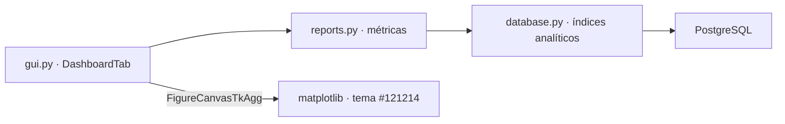

# Panel de Analítica Visual y UX Premium

> El tablero de Recursos Humanos: tres bloques analíticos en vivo dentro
> del panel oculto de la aplicación de escritorio, dibujados sobre el
> Modo Oscuro Premium (#121214) con grillas sutiles y tipografía limpia.

## Dashboard Analítico (5.ª pestaña de gestión)

Accesible solo con `admin`/`admin123` (o RRHH) desde el Panel de Gestión.
Un botón **Actualizar** recarga las métricas en el momento; la etiqueta de
la cabecera muestra la fecha y hora del último refresco.

### Llegadas Tardías por Día · Mes en Curso

Gráfico de línea con marcadores que recorre los días del mes del 1 hasta
hoy. El día con mayor incidencia se destaca en rojo con la anotación
"Pico" y el área bajo la curva se rellena con un degradado sutil del azul
eléctrico (#1A56DB). Los días sin incidencias completan la serie con cero.

### Horas Extra 50% vs 100% por Departamento

Barras agrupadas por departamento (azul eléctrico para el recargo 50% y
dorado #F5C26B para el 100%), con el valor de cada barra rotulado encima.
Agrupa en SQL con `EXTRACT(EPOCH FROM SUM(...)) / 3600` y ordena por el
total acumulado de mayor a menor.

### Tarjeta de Métricas · Aguinaldo Proporcional

Panel destacado con el número grande del **total acumulado en Guaraníes**
(devengo mensual de `salario / 12` según la Ley N.º 6380/2019), su
equivalencia en millones, empleados activos, meses devengados, proyección
anual y el desglose por departamento.

## Backend analítico indexado

- `database.py`: columna `users.departamento` (migración automática con
  asignación por rol: Dirección y Administración / Operaciones) e índices
  `idx_users_departamento` y `idx_marcajes_analitica (es_tardanza,
  hora_entrada)` que aceleran las tres consultas agregadas.
- `reports.py`: `obtener_metricas_tardanzas()` (serie diaria completa con
  ceros), `obtener_horas_extra_por_departamento()` (horas 50/100 por área)
  y `obtener_proyeccion_aguinaldos_totales()` (totales acumulados y anuales
  en Gs., globales y por departamento).
- Los gráficos se dibujan con **matplotlib** embebido vía
  `FigureCanvasTkAgg` en el lienzo de CustomTkinter.

## UX refinada

- Modo Recepción: el único botón maestro **REGISTRAR ASISTENCIA** detecta
  automáticamente si corresponde Entrada o Salida.
- Consulta Local: rango dinámico **desde el 1 de enero hasta hoy** con
  validación amable (no acepta fechas fuera del año en curso ni posteriores
  a hoy) y entrada del modal con transición suave de opacidad.

## Vinculación

- [[Diseño de Interfaz Premium UI-UX]]
- [[Ecosistema Sistema de Marcación]]
- [[Panel de Reportes y Auditoría]]
- [[Módulo de Justificaciones y Aguinaldos]]
- [[Seguridad y Cifrado de Comunicaciones]]
- [[Estructura Web y Conexión Biométrica]]