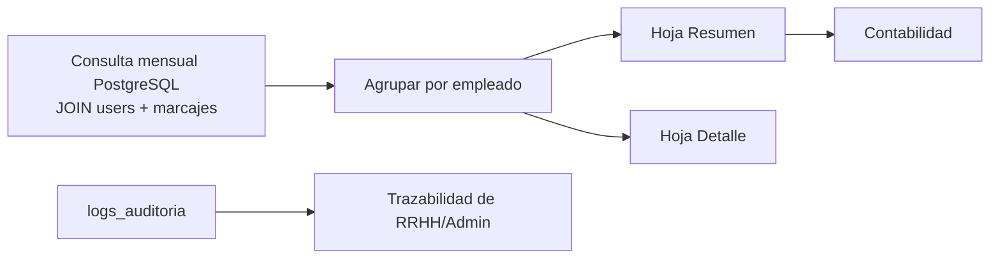

# Panel de Reportes y Auditoría

> Exportación mensual de asistencia para contabilidad y trazabilidad completa de operaciones, alimentada por [[Motor de Reglas de Horas Extra]] dentro del [[Ecosistema Sistema de Marcación]].

## Módulo `src/reports.py`



`exportar_asistencia_mensual(db, actor, anio, mes, formato, ruta)`:

1. Valida el rol del solicitante con RBAC (solo Administrador y RRHH).
2. Consulta los marcajes del mes con datos del empleado.
3. Agrupa por empleado y suma las columnas `INTERVAL`.
4. Exporta a **Excel (.xlsx)** o **CSV** en `reportes/` (carpeta ignorada por Git).

## Estructura del Excel

### Hoja "Resumen" (por empleado)

| Usuario | Nombre | Días | Tardanzas | Ordinarias | Extra 50% | Extra 100% | Total |
| --- | --- | --- | --- | --- | --- | --- | --- |

### Hoja "Detalle" (por marcaje)

| Usuario | Nombre | Fecha | Entrada | Salida | Feriado | Tardanza | Ordinarias | Extra 50% | Extra 100% |
| --- | --- | --- | --- | --- | --- | --- | --- | --- | --- |

- Duraciones en formato `HH:MM`.
- CSV con codificación UTF-8 BOM para que Excel abra bien los acentos; incluye solo el resumen.

## Control de acceso

| Acción | Administrador | RRHH | Empleado |
| --- | :-: | :-: | :-: |
| Exportar reportes mensuales | ✔ | ✔ | ✖ |

La validación ocurre dentro de `reports.py` vía `auth.require_role`, no solo en el menú de `app.py`.

## Auditoría interna (`logs_auditoria`)

Cada operación de RRHH/Administrador sobre usuarios queda registrada con:

| Campo | Descripción |
| --- | --- |
| `usuario_id` | Quién realizó la operación |
| `accion` | `CREAR`, `ACTUALIZAR` o `ELIMINAR` |
| `tabla` / `registro_id` | Qué se modificó |
| `valores_anteriores` / `valores_nuevos` | JSONB con el antes y el después |
| `creado_en` | Cuándo (TIMESTAMPTZ) |

```python
db.registrar_auditoria(
    actor["id"], "ACTUALIZAR", "users", user_id,
    anterior={"full_name": "Ana", "role_id": 2},
    nuevos={"full_name": "Ana", "role_id": 1},
)
```

Objetivo: **prevenir fraudes internos** — cualquier cambio de rol, alta o baja queda trazado y consultable desde DBeaver en la tabla `logs_auditoria`.

## Uso

Desde el menú de `app.py` (opción 9, visible solo para Administrador/RRHH): indicar año, mes y formato. El archivo queda en `reportes/asistencia_AAAA-MM.xlsx|csv`.