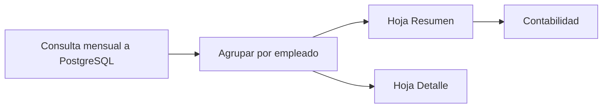

# Panel de Reportes y Auditoría

> Exportación mensual de asistencia para el departamento de contabilidad, alimentada por [[Motor de Reglas de Horas Extra]] dentro del [[Ecosistema Sistema de Marcación]].

## Módulo `src/reports.py`

`exportar_asistencia_mensual(db, actor, anio, mes, formato, ruta)`:

1. Valida el rol del solicitante con RBAC (solo Administrador y RRHH).
2. Consulta los `marcajes` del mes con datos del empleado (`JOIN users`).
3. Agrupa por empleado y suma las columnas `INTERVAL`.
4. Exporta a **Excel (.xlsx)** o **CSV** en `reportes/` (carpeta ignorada por Git).

## Estructura del Excel

### Hoja "Resumen" (por empleado)

| Usuario | Nombre | Días | Ordinarias | Extra 50% | Extra 100% | Total |
| --- | --- | --- | --- | --- | --- | --- |

### Hoja "Detalle" (por marcaje)

| Usuario | Nombre | Fecha | Entrada | Salida | Feriado | Ordinarias | Extra 50% | Extra 100% |
| --- | --- | --- | --- | --- | --- | --- | --- | --- |

- Duraciones en formato `HH:MM`.
- CSV con codificación UTF-8 BOM para que Excel abra bien los acentos; solo incluye el resumen.

## Control de acceso

| Acción | Administrador | RRHH | Empleado |
| --- | :-: | :-: | :-: |
| Exportar reportes mensuales | ✔ | ✔ | ✖ |

La validación ocurre dentro de `reports.py` vía `auth.require_role`, no solo en el menú de `app.py`.

## Auditoría

Cada marcaje registra: `hora_entrada`, `hora_salida`, `es_feriado`, los tres desgloses horarios y `created_at`. El detalle mensual permite:

- Conciliar horas pagadas vs. marcadas.
- Verificar el tratamiento de domingos y feriados (recargo 100%).
- Auditar turnos nocturnos (límite de 7 h ordinarias).

## Uso

Desde el menú de `app.py` (opción 9, visible solo para Administrador/RRHH): indicar año, mes y formato. El archivo queda en `reportes/asistencia_AAAA-MM.xlsx|csv`.