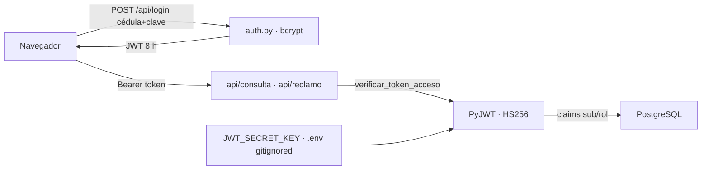

# Seguridad y Cifrado de Comunicaciones

> La capa que protege el autoservicio web: sesiones con tokens JWT firmados,
> contraseñas con hash bcrypt de 60 caracteres, secretos fuera del
> repositorio y endpoints que jamás confían en lo que viaja en el
> formulario.

> [!danger] Esta nota describe el diseño previsto, no el nivel de protección real
> La auditoría del 2026-09-13 encontró una cadena que permite a **un empleado cualquiera tomar la sesión de un Administrador**. Ver [[Auditoría Técnica · Hallazgos Críticos]] y la sección "Brechas abiertas" al final de esta nota.

## Sesiones por tokens JWT (`src/auth.py`)

El servidor web es **sin estado**: no guarda sesiones en memoria ni en
cookie; cada petición se valida con un token firmado criptográficamente.

- `crear_token_acceso(usuario_id, rol)` emite un JWT con claims `sub`
  (identidad), `rol` y vigencia de exactamente **8 horas** (`exp`/`iat` en
  UTC). La firma usa **HS256** con la clave `JWT_SECRET_KEY` del `.env`.
- `verificar_token_acceso(token)` valida firma y expiración en cada
  petición; un token manipulado, vencido o firmado con otra clave eleva
  `jwt.InvalidTokenError` y se traduce en un **401 con
  `WWW-Authenticate: Bearer`**.
- La clave secreta se genera con `secrets.token_urlsafe(48)` y vive
  **solo en el `.env`**, que está bloqueado por `.gitignore`: nunca viaja a
  GitHub. Si falta, el código cae a una clave de desarrollo claramente
  marcada como insegura.

## Inicio de sesión (`POST /api/login`)

- Recibe cédula/usuario y contraseña; la verifica contra el hash bcrypt
  almacenado en `users` (60 caracteres, sal integrada, rounds 12) con
  `bcrypt.checkpw`.
- Credenciales inválidas → 401 genérico ("Cédula o contraseña
  incorrectas") para no filtrar qué dato falló.
- Válido → devuelve `{token, rol, nombre, vigencia_horas}`.

## Endpoints protegidos

- `POST /api/consulta` e `POST /api/reclamo` **exigen** `Authorization:
  Bearer <token>` vía la dependencia FastAPI `_usuario_autenticado`.
- La **identidad se resuelve desde el token**, no desde el formulario: la
  cédula fue eliminada de los cuerpos de petición y de la URL. Aunque
  alguien manipule el HTML, el servidor siempre consulta los datos del
  usuario autenticado.
- Cada petición abre y cierra su propia conexión PostgreSQL; las consultas
  son de solo lectura.

## Sesión en el navegador

- El token vive en la cookie `marcacion_sesion`, marcada `HttpOnly`,
  `SameSite=Strict` y `Secure` cuando la conexión lo es. JavaScript no puede
  leerla, así que un XSS no se la lleva.
- El navegador la adjunta solo; el cliente nunca la toca. El WebSocket es el
  caso que forzó la decisión: un saludo de WebSocket no admite cabeceras
  propias, y la alternativa era el token en la query string.
- Si falta o expiró, el cliente recibe 401 y la interfaz **redirige al login**
  con el mensaje "Sesión expirada. Ingrese nuevamente".
- "Cerrar sesión" pega contra `POST /api/logout`, que borra la cookie desde el
  servidor: es el único que puede, justamente por ser `HttpOnly`.

## Brechas que hubo, y cómo se cerraron

Esta sección listaba seis brechas abiertas. Están todas cerradas; queda el
registro porque el *por qué* de cada defensa se entiende mejor junto al ataque
que la motivó. El detalle vive en [[Auditoría Técnica · Hallazgos Críticos]].

| Brecha | Qué permitía | Cómo se cerró |
| --- | --- | --- |
| **P0-3 · Cadena de toma de cuenta** | `POST /api/alertas` exigía token pero no rol, y el toast renderizaba con `innerHTML` sin escapar. El siguiente usuario de RRHH que abriera el portal ejecutaba ese código con su sesión | Rol exigido en el endpoint, escapado en el toast y `Content-Security-Policy` que contiene lo que se escape |
| **P0-4 · El respaldo de clave era la vulnerabilidad** | `JWT_SECRET_KEY` ausente no rompía nada: el sistema firmaba con una clave publicada en el repositorio, y cualquiera fabricaba un token `rol: Administrador`. Igual en `COMPROBANTE_CLAVE`, que dejaba los comprobantes falsificables | Los secretos no tienen valor por defecto y se validan al arrancar. Sin ellos el proceso no levanta |
| **P3-2 · La sesión en `localStorage`** | Es lo que convertía el XSS en robo de sesión. El mismo hallazgo cubría el token viajando en la query string de los PDF y del WebSocket, donde queda en logs de acceso, historial e `Referer` | Cookie `HttpOnly` + `SameSite=Strict` + `Secure`, descrita arriba |
| **P3-3 · Login sin límite de intentos** | Fuerza bruta contra las contraseñas y, a la vez, denegación de servicio: bcrypt es caro por diseño, así que bastaba con mandar credenciales inválidas en volumen | Freno por intentos, más abajo en esta nota |
| **Faltaban cabeceras de seguridad** | Sin CSP nada contiene un XSS una vez que ocurre; tampoco había `X-Frame-Options`, `X-Content-Type-Options` ni HSTS | Se emiten en toda respuesta, y CI lo comprueba sobre un `GET` real |
| **P3-1 · Biometría sin cifrar** | La tabla `fotos` guardaba el rostro en `BYTEA` plano. Bajo la Ley 6534/2020 es dato de categoría especial: un backup filtrado exponía la plantilla facial completa | AES-256-GCM con la clave fuera de la base, en la sección siguiente |

**Lo que queda abierto es uno solo, y es honesto**: la prueba de vida del kiosco
es un disuasivo, no una prueba. Ver P1-2b en la auditoría.

## Datos biométricos en reposo (Ley N.º 6534/2020)

La plantilla facial es dato personal de **categoría especial**: a diferencia de una contraseña, la persona no puede cambiarla si se filtra. Guardarla como JPEG plano en la columna `fotos.imagen` significaba que un volcado de la base —o una copia de seguridad extraviada— entregaba el rostro de toda la plantilla laboral.

`src/biometria.py` la sella con **AES-256-GCM** antes de que salga del proceso:

| Decisión | Por qué |
| --- | --- |
| Cifrado **autenticado** (GCM) | Una foto alterada en la base no se descifra en silencio: falla |
| El `user_id` viaja como dato asociado | Mover la foto de una fila a otra la vuelve ilegible; no se reasigna un rostro editando la base |
| Clave en `BIOMETRIA_CLAVE`, fuera de la base | Quien obtiene un backup no obtiene con qué abrirlo |
| Prefijo `BIO1` en el blob | Distingue lo cifrado de lo que quedó en claro y permite migrar sin perder registros |
| Sin clave, `descifrar` devuelve `None` | El control queda en *no verificable* y avisa, en vez de tumbar el kiosco |

**Retención**: la baja del empleado destruye la plantilla facial. El fin que legitimaba el tratamiento se acaba con la relación laboral; el resto del legajo se conserva porque lo exige el archivo laboral.

Lo que **no** cubre: LBPH no tiene prueba de vida, así que una foto en la pantalla de un celular sigue pasando la verificación. Eso es un cambio de motor, no de cifrado.

## Freno a la fuerza bruta

La cédula es pública en Paraguay, así que sin límite de intentos la contraseña de cualquier empleado cae por diccionario; el costo de bcrypt no alcanza cuando el atacante paraleliza.

`src/rate_limit.py` cuenta los fallos en una ventana deslizante: **8 intentos por 5 minutos, bloqueo de 15**, contabilizados por cédula **y** por IP de origen. Por cédula para que un diccionario contra una persona se agote; por origen para que recorrer la plantilla entera probando una contraseña común tampoco salga gratis.

Es honesto decir qué no cubre: la ventana vive en memoria del proceso, así que con cuatro workers el umbral efectivo se multiplica por cuatro. Frena un ataque de diccionario y no reemplaza a un límite en el proxy de entrada.

## El contenedor no corre como root

El `Dockerfile` crea el usuario `marcacion` (uid 10001) y cambia a él antes del `CMD`. El proceso no necesita privilegios, y correr como root convierte cualquier lectura de archivo arbitraria en acceso total al contenedor.

## Vinculación

- [[Auditoría Técnica · Hallazgos Críticos]]
- [[Antifraude y Resiliencia en Picos de Marcación]]
- [[Estructura Web y Conexión Biométrica]]
- [[Ecosistema Sistema de Marcación]]
- [[Módulo de Gestión de Usuarios]]
- [[Diseño de Interfaz Premium UI-UX]]
- [[Panel de Reportes y Auditoría]]