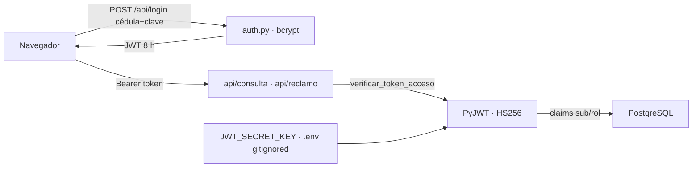

# Seguridad y Cifrado de Comunicaciones

> La capa que protege el autoservicio web: sesiones con tokens JWT firmados,
> contraseñas con hash bcrypt de 60 caracteres, secretos fuera del
> repositorio y endpoints que jamás confían en lo que viaja en el
> formulario.

## Sesiones por tokens JWT (`src/auth.py`)

El servidor web es **sin estado**: no guarda sesiones en memoria ni en
cookie; cada petición se valida con un token firmado criptográficamente.

- `crear_token_acceso(usuario_id, rol)` emite un JWT con claims `sub`
  (identidad), `rol` y vigencia de exactamente **8 horas** (`exp`/`iat` en
  UTC). La firma usa **HS256** con la clave `JWT_SECRET_KEY` del `.env`.
- `verificar_token_acceso(token)` valida firma y expiración en cada
  petición; un token manipulado, vencido o firmado con otra clave eleva
  `jwt.InvalidTokenError` y se traduce en un **401 con
  `WWW-Authenticate: Bearer`**.
- La clave secreta se genera con `secrets.token_urlsafe(48)` y vive
  **solo en el `.env`**, que está bloqueado por `.gitignore`: nunca viaja a
  GitHub. Si falta, el código cae a una clave de desarrollo claramente
  marcada como insegura.

## Inicio de sesión (`POST /api/login`)

- Recibe cédula/usuario y contraseña; la verifica contra el hash bcrypt
  almacenado en `users` (60 caracteres, sal integrada, rounds 12) con
  `bcrypt.checkpw`.
- Credenciales inválidas → 401 genérico ("Cédula o contraseña
  incorrectas") para no filtrar qué dato falló.
- Válido → devuelve `{token, rol, nombre, vigencia_horas}`.

## Endpoints protegidos

- `POST /api/consulta` e `POST /api/reclamo` **exigen** `Authorization:
  Bearer <token>` vía la dependencia FastAPI `_usuario_autenticado`.
- La **identidad se resuelve desde el token**, no desde el formulario: la
  cédula fue eliminada de los cuerpos de petición y de la URL. Aunque
  alguien manipule el HTML, el servidor siempre consulta los datos del
  usuario autenticado.
- Cada petición abre y cierra su propia conexión PostgreSQL; las consultas
  son de solo lectura.

## Sesión en el navegador

- El token se guarda en `localStorage` y se adjunta automáticamente a cada
  petición por JavaScript.
- Si el token falta o expiró, el cliente recibe 401 y la interfaz limpia la
  sesión y **redirige al formulario de login** con el mensaje "Sesión
  expirada. Ingrese nuevamente".
- El botón "Cerrar sesión" elimina el token del navegador al instante.

## Vinculación

- [[Estructura Web y Conexión Biométrica]]
- [[Ecosistema Sistema de Marcación]]
- [[Módulo de Gestión de Usuarios]]
- [[Diseño de Interfaz Premium UI-UX]]
- [[Panel de Reportes y Auditoría]]