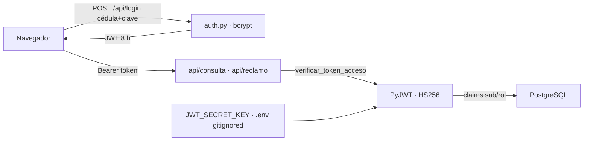

# Seguridad y Cifrado de Comunicaciones

> La capa que protege el autoservicio web: sesiones con tokens JWT firmados,
> contraseñas con hash bcrypt de 60 caracteres, secretos fuera del
> repositorio y endpoints que jamás confían en lo que viaja en el
> formulario.

> [!danger] Esta nota describe el diseño previsto, no el nivel de protección real
> La auditoría del 2026-09-13 encontró una cadena que permite a **un empleado cualquiera tomar la sesión de un Administrador**. Ver [[Auditoría Técnica · Hallazgos Críticos]] y la sección "Brechas abiertas" al final de esta nota.

## Sesiones por tokens JWT (`src/auth.py`)

El servidor web es **sin estado**: no guarda sesiones en memoria ni en
cookie; cada petición se valida con un token firmado criptográficamente.

- `crear_token_acceso(usuario_id, rol)` emite un JWT con claims `sub`
  (identidad), `rol` y vigencia de exactamente **8 horas** (`exp`/`iat` en
  UTC). La firma usa **HS256** con la clave `JWT_SECRET_KEY` del `.env`.
- `verificar_token_acceso(token)` valida firma y expiración en cada
  petición; un token manipulado, vencido o firmado con otra clave eleva
  `jwt.InvalidTokenError` y se traduce en un **401 con
  `WWW-Authenticate: Bearer`**.
- La clave secreta se genera con `secrets.token_urlsafe(48)` y vive
  **solo en el `.env`**, que está bloqueado por `.gitignore`: nunca viaja a
  GitHub. Si falta, el código cae a una clave de desarrollo claramente
  marcada como insegura.

## Inicio de sesión (`POST /api/login`)

- Recibe cédula/usuario y contraseña; la verifica contra el hash bcrypt
  almacenado en `users` (60 caracteres, sal integrada, rounds 12) con
  `bcrypt.checkpw`.
- Credenciales inválidas → 401 genérico ("Cédula o contraseña
  incorrectas") para no filtrar qué dato falló.
- Válido → devuelve `{token, rol, nombre, vigencia_horas}`.

## Endpoints protegidos

- `POST /api/consulta` e `POST /api/reclamo` **exigen** `Authorization:
  Bearer <token>` vía la dependencia FastAPI `_usuario_autenticado`.
- La **identidad se resuelve desde el token**, no desde el formulario: la
  cédula fue eliminada de los cuerpos de petición y de la URL. Aunque
  alguien manipule el HTML, el servidor siempre consulta los datos del
  usuario autenticado.
- Cada petición abre y cierra su propia conexión PostgreSQL; las consultas
  son de solo lectura.

## Sesión en el navegador

- El token se guarda en `localStorage` y se adjunta automáticamente a cada
  petición por JavaScript.
- Si el token falta o expiró, el cliente recibe 401 y la interfaz limpia la
  sesión y **redirige al formulario de login** con el mensaje "Sesión
  expirada. Ingrese nuevamente".
- El botón "Cerrar sesión" elimina el token del navegador al instante.

## Brechas abiertas

Lo que esta nota afirma y el código no sostiene, ordenado por gravedad:

**La cadena de toma de cuenta (P0-3).** `POST /api/alertas` exige token pero no valida rol, así que cualquier empleado publica una alerta con contenido arbitrario dirigida a todos los conectados. El toast que la muestra renderiza con `innerHTML` sin escapar. El siguiente usuario de RRHH que abra el portal ejecuta ese código con su sesión, y como el token vive en `localStorage`, se lo lleva. Ocho horas de acceso administrativo.

**El respaldo de clave es la vulnerabilidad (P0-4).** Donde arriba se lee *"si falta, el código cae a una clave de desarrollo claramente marcada como insegura"*, hay que leer: **si la variable falta, el sistema firma tokens con una clave que está publicada en el repositorio**. Un atacante fabrica un token con `rol: Administrador` y entra. Un secreto ausente debe impedir el arranque, no degradarse en silencio. Mismo problema en `COMPROBANTE_CLAVE` (`reports.py`), que deja los comprobantes "de fidelidad legal" falsificables.

**`localStorage` es alcanzable por JavaScript (P3-2).** Es lo que convierte el XSS anterior en robo de sesión. Una cookie `HttpOnly` + `Secure` + `SameSite=Strict` corta ese vector. El mismo hallazgo cubre el token viajando en la query string de los PDF y del WebSocket, donde queda en logs de acceso, historial del navegador y cabecera `Referer`.

**`POST /api/login` no tiene límite de intentos (P3-3).** Fuerza bruta contra contraseñas de empleados y, a la vez, vector de denegación de servicio: bcrypt es caro por diseño, así que basta con enviar credenciales inválidas en volumen para saturar la CPU.

**Faltan cabeceras de seguridad.** Sin `Content-Security-Policy`, nada contiene un XSS una vez que ocurre. Tampoco hay `X-Frame-Options`, `X-Content-Type-Options` ni HSTS.

**Los datos biométricos están sin cifrar (P3-1).** La tabla `fotos` guarda el rostro en `BYTEA` plano. Bajo la Ley 6534/2020 es dato de categoría especial; un backup filtrado expone la plantilla facial completa.

### Orden de corrección

1. Escapar el toast + exigir rol en `POST /api/alertas` + CSP — cierra la cadena de toma de cuenta.
2. Secretos sin valor por defecto, con validación al arrancar.
3. Migrar la sesión a cookie `HttpOnly`.
4. *Rate limiting* en autenticación.
5. Cifrado de la columna biométrica con clave gestionada fuera de la base.

## Vinculación

- [[Auditoría Técnica · Hallazgos Críticos]]
- [[Antifraude y Resiliencia en Picos de Marcación]]
- [[Estructura Web y Conexión Biométrica]]
- [[Ecosistema Sistema de Marcación]]
- [[Módulo de Gestión de Usuarios]]
- [[Diseño de Interfaz Premium UI-UX]]
- [[Panel de Reportes y Auditoría]]